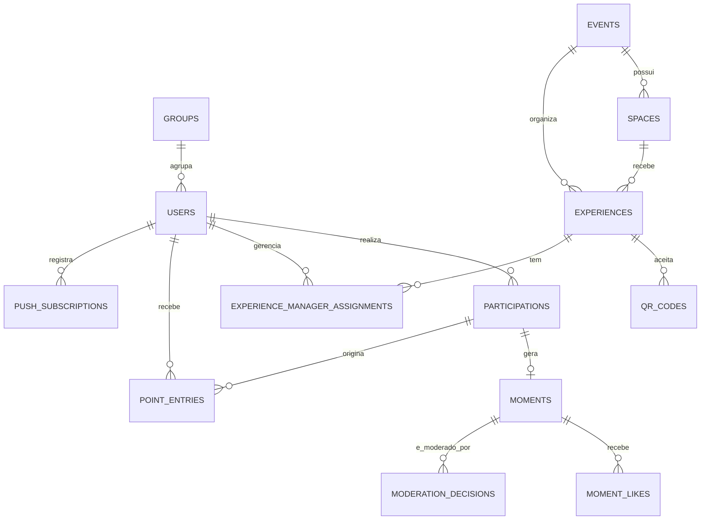

# DNJ 2K26 - schema logico e alinhamento de API

**Escopo deste documento:** homologacao do Next. Ele documenta o schema que a API Next deve suportar hoje e que o backend real devera preservar depois. O schema foi aplicado ao Supabase de homologacao em 2026-08-05; o repositorio `dnj-game-api` continua sem alteracoes.

O contrato completo e legivel por Swagger em [`docs/api/dnj-experience.openapi.yaml`](../../../docs/api/dnj-experience.openapi.yaml).

## Fundacao de identidade adotada

O projeto de API existente foi apenas consultado como referencia de compatibilidade. A fronteira do frontend passa a assumir:

| Conceito | Campo/valor de contrato | Regra |
| --- | --- | --- |
| Usuario | `id: string` | ID externo e string decimal; nao converter para `number` no JavaScript. |
| Grupo | `groupId: string \| null` | Um participante pode nao ter grupo. |
| Papel | `DEFAULT`, `EVENT_MANAGER`, `ADMIN` | Mapeiam respectivamente para participante, gestor e admin. |
| Data | string ISO 8601 UTC | Ex.: `2026-08-05T18:30:00.000Z`. |
| Chave de repeticao | `idempotencyKey` UUID | Mesmo comando + mesma chave devolve o mesmo resultado logico. |

`src/lib/api/roles.ts` concentra o mapeamento de papel. O cliente nunca autoriza a si proprio: a futura API deve derivar o papel da identidade validada no servidor.

## Schema canônico de homologação

As tabelas abaixo existem no Supabase de homologacao. As migrations versionadas deste repositorio sao:

- `20260805175529_create_dnj_homologation_schema.sql` — dominio operacional e compatibilidade com as tabelas legadas;
- `20260805175712_harden_dnj_homologation_access.sql` — RLS, politicas apenas para `service_role`, bucket privado e indices de FKs;
- `20260805175804_add_missing_queue_event_index.sql` — indice restante de `queues.event_id`.
- `20260805182007_refine_qr_and_moment_moderation.sql` — janelas independentes de QR e ciclo de moderacao exclusivo de Momentos.
- `20260805183926_fix_moderate_moment_row_assignment.sql` — correcao do carregamento da linha no RPC de moderacao.

As tabelas legadas `gallery_*`, `operation_events`, `push_subscriptions` e `notification_campaigns` foram preservadas para as rotas administrativas atuais. O novo dominio e a fonte canonica para as proximas Route Handlers de evento.

| Tabela | Colunas essenciais | Integridade e indices |
| --- | --- | --- |
| `events` | `id`, `slug`, `name`, `starts_at`, `ends_at`, `status` | `slug` unico; `starts_at < ends_at`. |
| `spaces` | `id`, `event_id`, `name`, `slug`, `map_reference` | unico `(event_id, slug)`. |
| `experiences` | `id`, `event_id`, `space_id`, `name`, `kind`, `starts_at`, `ends_at`, `check_in_points`, `cooldown_seconds`, `status` | indice `(event_id, status, starts_at)`; janela temporal valida. |
| `experience_manager_assignments` | `experience_id`, `user_id`, `created_at` | PK ou unique composto; usuario precisa de papel `EVENT_MANAGER` ou `ADMIN`. |
| `qr_codes` | `id`, `experience_id`, `token_hash`, `expiration_time`, `expiration_momento_time`, `max_uses`, `used_count`, `status` | `token_hash` unico; nunca persistir token puro. |
| `participations` | `id`, `user_id`, `event_id`, `experience_id`, `qr_code_id`, `checked_in_at`, `cooldown_ends_at`, `status`, `idempotency_key` | unique `(user_id, experience_id, idempotency_key)`; indice `(user_id, status, checked_in_at desc)`. |
| `media_objects` | `id`, `owner_user_id`, `storage_key`, `content_type`, `bytes`, `created_at` | `storage_key` unico; objeto privado por padrao. |
| `moments` | `id`, `participation_id`, `media_object_id`, `publication_status`, `moderation_status`, `captured_at`, `points_awarded` | unique por regra de experiencia/participacao; indice de feed `(publication_status, moderation_status, captured_at desc)`. |
| `moment_likes` | `moment_id`, `user_id`, `created_at` | unique `(moment_id, user_id)`. |
| `moderation_decisions` | `id`, `moment_id`, `moderator_user_id`, `decision`, `reason`, `created_at` | indice `(moment_id, created_at desc)`; decisao atual materializada em `moments.moderation_status`. |
| `point_entries` | `id`, `user_id`, `participation_id`, `reason`, `delta`, `idempotency_key`, `created_at` | ledger imutavel; unique por comando idempotente; saldo e derivado, nao fonte mutavel. |
| `push_subscriptions` | `id`, `user_id`, `endpoint`, `p256dh`, `auth`, `updated_at` | `endpoint` unico. |
| `notification_campaigns` | `id`, `title`, `body`, `target`, `sent_at`, `created_by` | campanha e resultado de entrega devem ser auditaveis. |
| `operation_audit` | `id`, `actor_user_id`, `action`, `subject_type`, `subject_id`, `metadata`, `created_at` | indice `(created_at desc)` e `(actor_user_id, created_at desc)`. |

O gestor opera apenas as experiencias a que esta vinculado. O admin pode consultar e moderar globalmente. O participante so ve/escreve recursos autorizados para sua identidade e grupo.

## Mapeamento para a API Next atual

| Dominio | Rota atual de homologacao | Contrato futuro equivalente |
| --- | --- | --- |
| Check-in QR | `POST /api/mock/v1/qr/validate` | `POST /v1/qr/validate` |
| Participacao atual | `GET /api/mock/v1/participations/current` | `GET /v1/participations/current` |
| Feed / meus / grupo | `GET /api/mock/v1/moments?scope=feed\|mine\|group` | `GET /v1/moments?scope=...` |
| Envio de momento | `POST /api/mock/v1/moments` | `POST /v1/moments` |
| Likes e comentarios antigos | `/api/mock/v1/gallery/*` | Manter temporariamente; novos clientes usam `moments`. |
| Painel admin | `/api/admin/*` | Contratos de operacao; autenticar por papel `ADMIN` no backend futuro. |
| Notificacoes web push | `/api/push/*` | Mesmo formato de inscricao; credenciais VAPID permanecem somente no servidor. |

## Regras de contrato

- JSON usa `camelCase` para a API do participante. As rotas administrativas atuais preservam os nomes de campos do read model (`created_at`, `display_name`) e isso esta explicitado no OpenAPI para nao haver ambiguidade durante a homologacao.
- Erros de experiencia usam `{ code, message, details? }`; erros administrativos atuais usam `{ error }`. A padronizacao para o backend futuro deve ser uma decisao separada, sem quebrar a homologacao atual.
- `cursor` e opaco: o cliente apenas o devolve como recebeu.
- Uma chamada idempotente deve ser persistida/serializada no servidor; nao basta confiar no estado da tela ou no banco do navegador.
- A imagem e armazenada em object storage. Banco guarda metadados/chaves, nao o binario.
- Moderacao nao deve ser inferida de `publishConsent`: consentimento permite solicitar publicacao; aprovacao e decisao posterior de moderacao.
- QR Code usa duas janelas independentes: `expiration_time` limita a leitura/check-in; `expiration_momento_time` limita a foto pontuada vinculada. Um QR pode permitir check-in sem permitir Momento (`expiration_momento_time` nulo).
- Moderacao pertence somente a `moments`: `approved` publica e concede o ledger uma vez; `deny_points` mantem a foto privada sem premio; `delete_photo` tambem remove o objeto privado e preserva a decisao auditavel.
- Todas as tabelas `public` da homologacao usam RLS. `anon` e `authenticated` nao possuem grants; somente a chave de servidor usada pelas Route Handlers Next pode acessa-las. O bucket privado `dnj-moments` segue a mesma regra.
