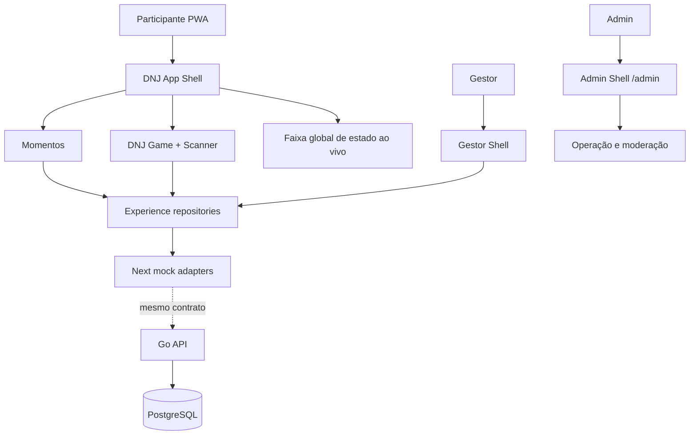

# DNJ 2K26 — Experiência, Operação e Contratos Design

**Spec:** `dnj-2k26-event-operations/spec.md`  
**Status:** Approved — direção escolhida: **Sticker em movimento**

## Approach Selection

| Approach | Trade-off | Decision |
| --- | --- | --- |
| Sticker em movimento | Uma assinatura forte exige disciplina para não virar efeito recorrente. | **Escolhida.** O sticker abre a experiência e identifica superfícies; a celebração fica restrita a QR confirmado. |
| Passaporte dominante | Dá unidade aos Momentos, mas desloca excessivamente Home e Game para uma metáfora de álbum. | Não escolhida. O passaporte fica em Meus Momentos. |
| Game intenso | Amplifica pontos, selos e partículas por toda a interface. | Não escolhida. A operação longa do evento pede foco e baixo ruído. |

## Architecture Overview



O frontend continuará chamando contratos de domínio, nunca detalhes de Supabase. Os Route Handlers e repositórios mockados são substituíveis por adaptadores HTTP para Go sem alterar a semântica dos componentes.

## Visual System

### Subject, audience and signature

O produto é o guia de bolso de uma juventude em movimento durante o DNJ. A assinatura é o **sticker que cola**: uma única entrada tátil/visual na primeira abertura, seguida por uma interface objetiva. A mesma forma reaparece discretamente como marca, nunca como decoração aleatória.

| Token | Value | Role |
| --- | --- | --- |
| `--brand-orange` | `#E87425` | CTA, scanner e energia institucional |
| `--brand-red` | `#DB3A2E` | detalhe do sticker e estados destrutivos |
| `--game-green` | `#B2D64D` | progresso, ranking e DNJ Game |
| `--deep-teal` | `#0D1A1A` | base escura, contraste e operação |
| `--surface-light` | `#F9F9F9` | superfície participante clara |
| `--surface-dark` | `#162626` | cards no modo escuro |

- **Fonte:** Space Grotesk para títulos, interface e dados; pesos 400/500/600/700. Não haverá uma segunda fonte para não fragmentar a marca.
- **Raio:** cards continuam `16px`; fotos de feed usam `20–24px`; fotos de passaporte usam borda menor e uma sombra curta tipo papel colado.
- **Sticker:** `Logo_DNJ_semsombra.png` é a fonte de marca-d'água; a versão com sombra pode ser usada apenas quando houver fundo complexo e a legibilidade exigir.

### Motion

| Moment | Behavior | Reduced motion |
| --- | --- | --- |
| Primeira entrada | sticker começa levemente fora do plano, entra com rotação curta, assenta com escala 1.03→1 | aparece estático, sem rotação nem overshoot |
| Navegação | transições atuais, rápidas e direcionais | fade simples |
| QR confirmado | burst breve de 12–18 partículas/estrelas, seguido do total de pontos | ícone estático, texto “Participação confirmada” e total de pontos |
| Curtida/compartilhar | microfeedback de escala/cor | troca de estado sem animação |

Os fireworks são uma camada visual não interativa, com duração máxima de 900 ms, sem bloquear leitor de tela, botão de fechar ou atualização de pontos.

## Participant Components

### BrandSticker

- **Purpose:** exibir a marca aprovada em entrada, TopBar e pontos de identidade.
- **Location:** `src/components/brand/brand-sticker.tsx`.
- **Interface:** `variant: "intro" | "header" | "watermark"`, `decorative?: boolean`.
- **Reuses:** `motion/react`, safe areas e `prefers-reduced-motion` já usados pelo App Shell.

### MomentsScreen

- **Purpose:** substituir a nomenclatura Galeria DNJ por Momentos e organizar Feed, Eu e Meu Grupo.
- **Location:** evolução de `src/features/gallery/gallery-screen.tsx` ou renomeação coordenada para `src/features/moments/`.
- **Interfaces:** `view: "feed" | "mine" | "group"`; `onOpenMoment(momentId)`.
- **Reuses:** `GalleryRepository`, `OperationFeedback`, `MomentComposer` e compartilhamento nativo existentes.

### MomentFeedCard and MomentDetail

- **Purpose:** manter a estrutura atual do feed, arredondando exclusivamente a área de imagem; expor curtida e compartilhar.
- **Location:** `src/features/moments/components/`.
- **Rules:** sem comentários, sem campo de texto e sem rota de comentário participante; foto com margem/padding independente do card.

### PassportGrid

- **Purpose:** renderizar Meu Momento e Meu Grupo em 3 colunas compactas.
- **Location:** `src/features/moments/components/passport-grid.tsx`.
- **Interface:** `items`, `scope: "mine" | "group"`, `onOpen`.
- **Rules:** três colunas no mobile alvo; cada célula apresenta foto, local curto e estado acessível; sem aba Grupo quando não houver grupo.

### QrSuccessCelebration

- **Purpose:** feedback de QR válido antes de abrir o resultado da participação.
- **Location:** `src/features/scanner/qr-success-celebration.tsx`.
- **Interface:** `points`, `label`, `onDone`.
- **Reuses:** `AnimatePresence`, `Participation` e a camada modal de `GameScreen`.

### LiveStatusStack

- **Purpose:** empilhar de forma legível alerta especial e acompanhamento de fila acima de qualquer tela participante.
- **Location:** `src/components/live/live-status-stack.tsx`.
- **Priority:** evento especial > fila; a fila continua resumida abaixo quando ambos existirem.

## Operational Components

| Component | Location | Purpose |
| --- | --- | --- |
| `ManagerShell` | `src/features/manager/manager-shell.tsx` | Área de gestor, sem BottomNav participante. |
| `ScheduleControl` | `src/features/manager/schedule-control.tsx` | Iniciar/avançar/encerrar cronograma e flex time. |
| `ActionControl` | `src/features/manager/action-control.tsx` | Abrir, pausar, listar participantes e distribuir resultado. |
| `AdminDashboard` | existente em `src/components/admin/` | Evoluir moderação e operação global; manter `/admin` separado. |
| `SpecialEventControl` | `src/features/admin/special-event-control.tsx` | Disparar teaser, QR, app, TV/telão e encerramento temporizado. |

## Contracts and Data Models

### Core types

```ts
type ActorRole = "participant" | "manager" | "admin";
type ExperienceKind = "scheduled" | "fixed" | "action" | "moment_challenge" | "special_qr";
type ExperienceStatus = "draft" | "active" | "paused" | "completed" | "expired";

interface Experience {
  id: string;
  kind: ExperienceKind;
  spaceId: string | null;
  scheduleEventId: string | null;
  name: string;
  startsAt: string | null;
  endsAt: string | null;
  scanExpiresAt: string | null;
  postExpiresAt: string | null;
  cooldownSeconds: number;
  points: { checkIn: number; momentBonus?: number; first?: number; second?: number; third?: number; participation?: number };
  status: ExperienceStatus;
}

interface MomentScopePage extends GalleryPage {
  scope: "feed" | "mine" | "group";
}
```

### Contracts

- `GET /v1/moments?scope=feed|mine|group&cursor=` substitui endpoints implícitos por uma consulta coerente; `scope=group` exige grupo no servidor.
- `POST /v1/participations` valida QR com `idempotencyKey`, retorna participação, elegibilidade de momento e total de pontos.
- `POST /v1/operations/actions/{id}/results` recebe classificação/participação e exige papel Gestor autorizado.
- `POST /v1/admin/special-events` e endpoints de moderação exigem Admin; todo efeito cria `operation_audit`.
- Mocks mantêm as mesmas respostas, status HTTP e códigos de erro; state compartilhado no processo só é uma aproximação de desenvolvimento, não garantia de produção.

## Code Reuse Analysis

| Existing component / contract | Location | Design use |
| --- | --- | --- |
| App Shell, TopBar, BottomNav | `src/components/layout/dnj-layout.tsx` | Trocar asset e label, preservar safe area e estrutura participante. |
| Galeria e share nativo | `src/features/gallery/gallery-screen.tsx` | Extrair Card/Imagem; retirar comentários; introduzir feed/passaporte. |
| Scanner | `src/features/scanner/qr-scanner-modal.tsx` | Encadear celebração após `validate`; preservar tratamento de câmera. |
| Resultado de QR | `src/features/game/game-screen.tsx` | Trocar a entrada direta no resultado pelo fluxo celebration → result. |
| Repositórios mockados | `src/lib/mocks/mock-experience-repositories.ts` | Ampliar domínio sem vazar detalhes ao componente. |
| Painel Admin e sessão | `src/components/admin/`, `src/app/admin/` | Manter rota/sessão isoladas; acrescentar módulos sem contaminar App Shell. |

## Error Handling Strategy

| Scenario | Handling | User impact |
| --- | --- | --- |
| QR aprovado | celebração termina e abre resultado com pontos | confirmação inequívoca, sem aguardar silenciosamente |
| QR recusado/expirado | feedback recuperável no scanner | pessoa entende por que não pontuou |
| Grupo indisponível | oculta a aba Grupo e mantém Eu | nenhuma UI quebrada ou vazia |
| Compartilhamento não suportado | fallback de texto/copiar já existente | pessoa ainda consegue compartilhar contexto |
| Gestor sem autorização | resposta `403 FORBIDDEN`, sem renderizar controles | evita operação indevida |
| Estado mock/offline | rótulo de demonstrativo/desatualizado | não induz confiança falsa |

## Risks & Concerns

| Concern | Location | Impact | Mitigation |
| --- | --- | --- | --- |
| Galeria atual ainda contém comentários e input | `src/features/gallery/gallery-screen.tsx` | Contraria a simplificação aprovada | Remover contrato/UI de comentários do caminho participante; preservar histórico apenas se houver dependência administrativa. |
| Scanner não modela seleção de câmera/zoom | `src/features/scanner/qr-scanner-modal.tsx` | Falha em aparelhos onde a câmera padrão não lê QR | Criar capability check e controle progressivo, com fallback claro. |
| Mock atual é state de processo | `src/lib/mocks/mock-experience-repositories.ts` | Não simula concorrência/recarga real | Usar apenas para UX; contratos e testes de estado serão preparados para API Go. |
| `Screen` de domínio está mais estreito que rotas ativas | `src/types/domain.ts` / `src/features/app/types.ts` | Pode gerar divergência de navegação | Consolidar tipos ao implementar, com testes de rota. |
| Troca global de logo pode afetar assets instaláveis | `src/app/icon.png`, `public/icons/` | Ícones podem cortar/deformar a marca | Respeitar AD-004: composições PWA continuam específicas. |

## Tech Decisions

| Decision | Choice | Rationale |
| --- | --- | --- |
| Direção visual | Sticker em movimento | Identidade memorável concentrada em um momento e não em efeitos contínuos. |
| Fontes | Space Grotesk única | Consistência e fidelidade à referência DNJ. |
| Momentos | Feed enxuto + passaporte 3-colunas | Separa descoberta coletiva de memória pessoal/grupal. |
| Celebração | Fireworks CSS/Motion, sem canvas pesado | Curta, acessível e compatível com PWA. |
| Backend boundary | Repositórios/contratos de domínio | Mocks Next e Go/PostgreSQL compartilham comportamento e erros. |

## Design Verification

- Conferir contraste de texto, badge e marca-d'água nos modos claro/escuro.
- Conferir primeira abertura, QR válido e QR inválido com `prefers-reduced-motion`.
- Conferir grade 3-colunas entre 320 px e 430 px e ausência de aba Grupo sem grupo.
- Conferir que participante não encontra rotas/ações de gestor ou admin.
- Conferir que Gestor/Admin recebem UI sem BottomNav participante.
