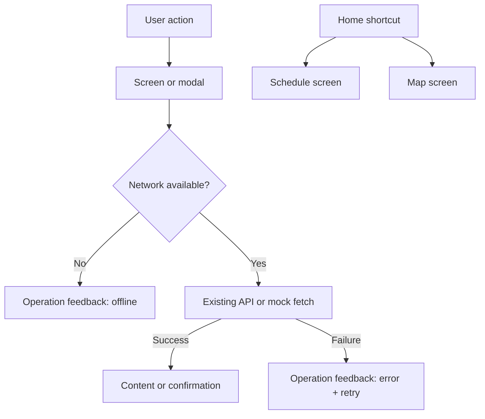

# DNJ Event Experience Design

**Spec:** .specs/features/dnj-event-experience/spec.md  
**Status:** Draft — approved visual direction

## Architecture Overview

A feature permanece client-side e reutiliza as fontes de verdade existentes: ApiError para classificar falhas, useNetworkStatus para conectividade, fixtures para conteúdo demonstrativo e componentes de layout atuais. A camada nova será pequena e reutilizável: estados de operação para listas/formulários, helpers de validação e superfícies dedicadas de mapa/crono.



## Code Reuse Analysis

| Existing code | Location | Use |
|---|---|---|
| API errors and timeout handling | src/lib/api/client.ts | Preserve error classification; map it to consistent user-facing feedback. |
| Connectivity banner | src/components/pwa/connectivity-status.tsx | Keep global network status; add local action-level feedback instead of duplicating it. |
| Network state hook | src/hooks/use-network-status.ts | Guard scanner and remote actions before opening work that requires network. |
| Controls and visual tokens | src/components/ui/dnj-controls.tsx and src/app/theme.css | Extend tokens and controls; keep interaction/motion conventions. |
| Current fixture data | src/features/app/fixtures.ts | Source mock schedule, map and event-space content. |
| Existing navigation state | src/components/dnj-app.tsx | Add schedule and map screens to the same state router; no URL routing change. |

## Components

### OperationFeedback

- **Purpose:** Represent loading failure, empty state, offline block and retry action consistently.
- **Location:** src/components/ui/operation-feedback.tsx
- **Interface:** variant, title, description, onRetry?, retryLabel?, compact?
- **Dependencies:** Lucide icons and theme tokens.
- **Reuses:** ConnectivityStatus copy and PrimaryButton behavior.

### FieldInput enhancement

- **Purpose:** Associate labels to inputs and render field-level validation text.
- **Location:** src/components/ui/dnj-controls.tsx
- **Interface:** id, error?, description? alongside existing input attributes.
- **Dependencies:** existing motion behavior.

### RegisterScreen enhancement

- **Purpose:** Transform account creation into a mobile-friendly two-step flow.
- **Location:** src/features/auth/auth-screens.tsx
- **Interface:** keeps the existing onBack, onDone and animDir contract.
- **Behavior:** Step 1 contains name, e-mail and WhatsApp; Step 2 contains group search/selection and alternatives. A compact progress indicator identifies the active step. Back returns to the prior step before leaving registration, and all entered values remain in local state.
- **Reuses:** FieldInput, BackButton, PrimaryButton and group fixtures/API lookup.

### EventScheduleScreen

- **Purpose:** Give mock event schedule a useful timeline organized as Agora, Em seguida and Mais tarde.
- **Location:** src/features/schedule/schedule-screen.tsx
- **Interface:** animDir and onBack.
- **Dependencies:** schedule fixture and BackButton.

### EventMapScreen

- **Purpose:** Show selectable map pins and a detail card for the selected event space.
- **Location:** src/features/map/map-screen.tsx
- **Interface:** animDir and onBack.
- **Dependencies:** MAP_PINS, SPACES and BackButton.

### HomeScreen enhancement

- **Purpose:** Establish a single operational hero and route to schedule/map.
- **Location:** src/features/home/home-screen.tsx
- **Interface:** user, animDir, onOpenSchedule, onOpenMap.
- **Dependencies:** schedule fixture and existing MissionPulse.

## Data Models

```typescript
interface ScheduleItem {
  id: string;
  period: "now" | "next" | "later";
  time: string;
  title: string;
  place: string;
  description?: string;
}

interface OperationFeedbackProps {
  variant: "error" | "empty" | "offline";
  title: string;
  description: string;
  onRetry?: () => void;
}
```

Both models stay local to the frontend. Schedule fixtures do not claim live availability.

## Error Handling Strategy

| Scenario | Handling | User impact |
|---|---|---|
| Offline scan/action | Block before opening API/camera flow; explain connection is required. | No wasted scan attempt. |
| Retryable API failure | Retain screen context and render retry action. | Clear recovery path. |
| Gallery fetch failure | Render OperationFeedback error, never empty gallery. | Failure is not mistaken for no content. |
| Empty remote result | Render OperationFeedback empty with contextual CTA. | Understandable next step. |
| Invalid field | Inline error linked to field; form remains intact. | Correct without guessing. |

## Visual System

- Set game token to #B2D64D, the exact green extracted from DNJGAME_01.png.
- In the DNJ Game screen, selected tabs, progress, ranking and scan FAB use the official green, except QR scan actions use orange.
- Remove the large QR scan card. First-access onboarding explains QR; after dismissal, a persistent orange floating action opens the scanner.
- Home leads with an Agora no DNJ card, followed by compact mission progress and three neutral navigation shortcuts.
- Use one strong focal surface per screen; lists/cards remain light with borders rather than repeated shadows.
- Registration uses two compact steps rather than one long scroll: Dados pessoais, then Grupo de jovens.

## Risks & Concerns

| Concern | Location | Impact | Mitigation |
|---|---|---|---|
| Screen state is centralized in one large component | src/components/dnj-app.tsx | New map/schedule routing can increase coupling. | Add only two screen states through existing switch; do not refactor router in this feature. |
| Gallery conflates fetch failure with empty result | src/features/gallery/gallery-screen.tsx | Misleading state. | Split error from empty and test both. |
| Queue uses a local timer as though live | src/features/queue/queue-screen.tsx | Erodes trust. | Label demo state and update time; do not change queue contract. |
| Visual snapshots are known to need review | .specs/STATE.md | Broader UI changes may invalidate baselines. | Update focused tests and run visual suite; report differences rather than weakening assertions. |

## Tech Decisions

| Decision | Choice | Rationale |
|---|---|---|
| Error library | No third-party package | Existing typed API errors and network status satisfy the need with smaller scope. |
| Feedback pattern | Reusable inline component, not global toasts | Keeps recovery next to the failed task and works under interruption. |
| Navigation | Existing in-memory Screen router | New screens remain consistent with current app architecture. |
| Mock disclosure | Visible status text on schedule/map/queue | Avoids presenting local fixture data as live event data. |
