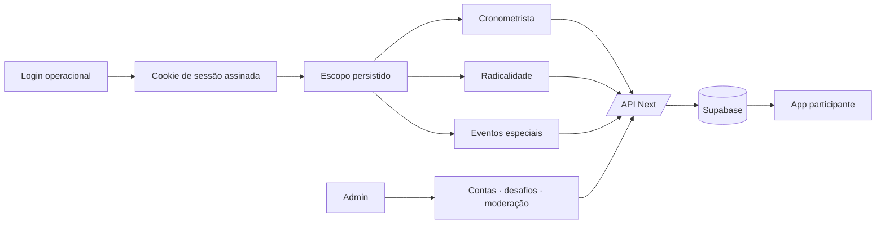

# Design — apps operacionais

## Decisões

- Reutilizar `test_users` como identidade; uma tabela de escopos expressa atribuições. Não criar um segundo catálogo de contas.
- Reutilizar `experiences`, `activity_runs`, `activity_run_participants`, `special_events`, `qr_codes`, `moments` e `point_entries` existentes.
- O estado de cada operação é a fonte de verdade no banco; a UI consulta/refaz leitura após mutações. Realtime só será adicionado se a operação real exigir atualização sub-segundo.
- Login operacional é uma superfície verde, simples e separada do login participante; Admin reaproveita a identidade operacional com escopo global.
- Desafio especial de Momento usa a mesma entidade `moments`: a regra do desafio fica na experiência e a decisão do Admin registra motivo, reversão de pontos e/ou exclusão de mídia.

