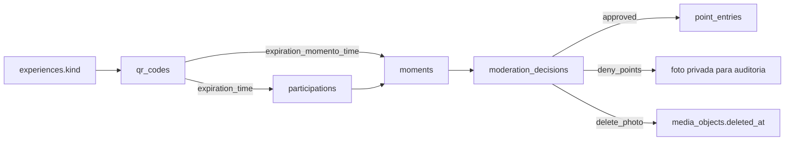

# Design

`experiences` e a camada comum. `kind` diferencia `schedule`, `stand`, `activity`, `moment_challenge` e `special`; tabelas operacionais como `activity_runs` e `special_events` estendem uma experiencia sem duplicar seus campos basicos.

Moderacao possui tres comandos mutuamente exclusivos:

- `approved`: `publication_status=public`, `moderation_status=approved`, `reward_status=awarded` e cria um unico ledger positivo.
- `deny_points`: `publication_status=private`, `moderation_status=rejected`, `reward_status=denied`; arquivo permanece disponivel apenas ao servidor.
- `delete_photo`: mesmos estados de negacao, `photo_status=deleted`, `media_objects.deleted_at` e exclusao do objeto pelo handler Next.

O RPC `moderate_moment` usa lock da linha e uma chave deterministica baseada no ID do Momento para impedir pontos duplicados ou reversoes duplicadas.
