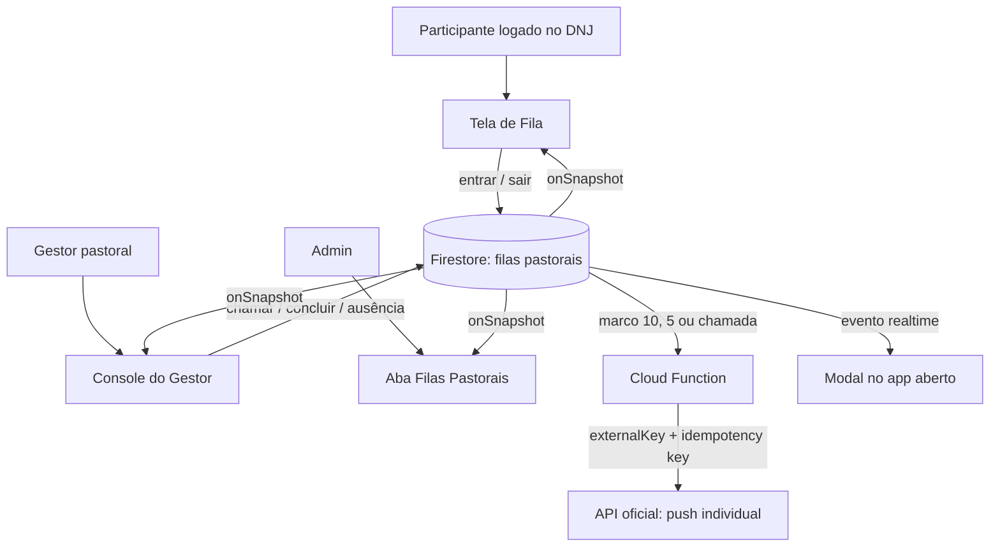

# Filas Pastorais no Firestore — Design

**Spec**: `.specs/features/pastoral-queues/spec.md`
**Status**: Approved

---

## Architecture Overview

Firestore será o estado operacional e realtime exclusivamente das filas pastorais. A identidade, o nome de exibição e os papéis continuam pertencendo ao DNJ/API existente: não haverá um segundo cadastro, sincronização de usuários nem ponte de Firebase Auth. O frontend envia apenas o identificador e nome já presentes na sessão para registrar a entrada, e usa as superfícies existentes para separar participante, gestor e Admin.



### Approaches considered

| Approach | Decision | Why |
| --- | --- | --- |
| Firebase Auth custom-token bridge | Rejected for this feature | Aumentaria a integração apenas para repetir identidade e papéis já resolvidos pelo DNJ/API. |
| **Firestore direto + Cloud Function de push** | **Chosen** | Reaproveita o modelo antigo, preserva realtime nativo e mantém a implementação isolada dos fluxos V2. |
| API/Next como único estado da fila | Rejected | Exigiria polling ou infraestrutura adicional para entregar o mesmo realtime. |

---

## Code Reuse Analysis

### Existing Components to Leverage

| Component | Location | How to Use |
| --- | --- | --- |
| Tela demonstrativa de fila | `src/features/queue/queue-screen.tsx` | Substituir estado local e posição demonstrativa pelo hook de Firestore; preservar fluxo de seleção, FAQ e confirmação de saída. |
| Sessão participante | `src/components/dnj-app.tsx` e `src/lib/api/contracts.ts` | Fornecer `user.id` e `user.name` já existentes à fila; não copiar e-mail para o Firestore. |
| Painel Admin | `src/components/admin/admin-dashboard.tsx` | Acrescentar aba somente de acompanhamento das duas filas. |
| Painel Gestor | `src/components/manager/manager-dashboard.tsx` | Acrescentar escopo `pastoral_queue` e o console de chamada/decisão. |
| Sessões operacionais | `src/app/api/admin/session/route.ts`, `src/app/api/manager/session/route.ts` | Manter a proteção das superfícies; não criar novo papel global. |
| Assinatura de push | `src/app/api/push/subscribe/route.ts` | Reutilizar a associação já existente entre `externalKey` e assinatura web. |
| Serviço worker | `scripts/build-service-worker.mjs`, `public/sw.js` | Manter a entrega padrão de push; não cachear dados da fila, conforme AD-002. |
| Fila anterior | `fila-dnj/Front/src/lib/useFirebaseQueue.ts` | Reaproveitar a ideia de listeners por tipo, transação e marcos, sem o WhatsApp no cliente nem funções abertas do legado. |

### Integration Points

| System | Integration Method |
| --- | --- |
| Firestore | SDK web no frontend para escrita/leitura realtime da fila; transações para mudanças que dependem da ordem atual. |
| Cloud Functions for Firebase | Trigger de criação/atualização de intenção de aviso; entrega push individual fora de transações. |
| API oficial | Contrato interno de push direcionado por `externalKey`, com chave de idempotência. |
| Papéis DNJ | `ADMIN` pode abrir a supervisão; `EVENT_MANAGER` recebe o escopo visual `pastoral_queue` para abrir o console operacional. |
| Configuração da operação | Documento global Firestore escutado pelo participante, Gestor e Function; apenas o Gestor o altera pela interface. |

---

## Components

### Firebase client and queue types

- **Purpose**: Inicializar Firestore e centralizar os tipos/constantes pastorais.
- **Location**: `src/lib/pastoral-queue/firebase.ts`, `src/lib/pastoral-queue/types.ts`
- **Interfaces**:
  - `PastoralQueueType = "confession" | "spiritual"`
  - `PastoralEntryStatus = "queued" | "called" | "completed" | "no_show" | "cancelled"`
- **Dependencies**: pacote `firebase`, variáveis públicas de configuração.
- **Reuses**: aliases TypeScript e convenções de `src/lib/api`.

### Queue service

- **Purpose**: Executar comandos e listeners do participante de modo idempotente.
- **Location**: `src/lib/pastoral-queue/service.ts`
- **Interfaces**:
  - `subscribeToMyQueue(userId, onChange): Unsubscribe`
  - `joinQueue(identity, type): Promise<QueueEntry>`
  - `leaveQueue(entryId, userId): Promise<void>`
  - `getQueueEligibility(userId): Promise<Eligibility>`
- **Dependencies**: Firestore client e transações.
- **Reuses**: padrão de erro/retry de `src/lib/api/client.ts` e o modelo de listener do legado.

### Queue configuration service

- **Purpose**: Ler e atualizar a configuração operacional global, incluindo abertura das duas filas e entrega de push.
- **Location**: `src/lib/pastoral-queue/config-service.ts`
- **Interfaces**:
  - `subscribeToQueueConfig(onChange): Unsubscribe`
  - `updateQueueConfig(patch: QueueConfig): Promise<QueueConfig>`
- **Dependencies**: Firestore client.
- **Reuses**: conceito de `config/default` do projeto anterior, sem `almostTherePosition` e sem WhatsApp.

### Participant queue screen

- **Purpose**: Trocar a simulação atual pela entrada, posição real, bloqueios e modal de aviso.
- **Location**: `src/features/queue/queue-screen.tsx`
- **Interfaces**:
  - recebe a identidade já disponível no shell do participante.
- **Dependencies**: queue service; modal da interface existente ou componente local mínimo.
- **Reuses**: cards, FAQ, transição e confirmação de saída da tela atual.

### Manager queue console

- **Purpose**: Mostrar as duas filas, chamar o próximo e decidir `completed`/`no_show` após a chamada.
- **Location**: `src/components/manager/pastoral-queue-console.tsx`
- **Interfaces**:
  - `subscribeToOperationsQueue(type, onChange): Unsubscribe`
  - `callNext(type, manager): Promise<CalledEntry | EmptyQueue>`
  - `resolveCalled(entryId, outcome, manager): Promise<void>`
- **Dependencies**: queue service, relógio de 2 minutos e escopo `pastoral_queue`.
- **Reuses**: painéis, feedback de erro e sessão de `manager-dashboard.tsx`.

### Admin queue overview

- **Purpose**: Exibir totais, próximos e pessoa chamada para supervisão.
- **Location**: `src/components/admin/pastoral-queue-overview.tsx`
- **Interfaces**:
  - `subscribeToAdminQueueOverview(onChange): Unsubscribe`
- **Dependencies**: queue service em modo de leitura.
- **Reuses**: navegação, loading e estados vazios do Admin existente.

### Notification intent Function

- **Purpose**: Entregar uma única notificação para os marcos 10, 5 e chamada.
- **Location**: `functions/src/pastoral-queue/notifications.ts` (novo projeto Firebase Functions isolado)
- **Interfaces**:
  - Trigger de documento `notification_intents/{intentId}`.
  - `POST` autenticado para a API oficial: `{ externalKey, title, body, idempotencyKey, kind }`.
- **Dependencies**: Firebase Admin, secret de integração da API oficial.
- **Reuses**: assinatura de push já vinculada à `externalKey`; não usa o endpoint de campanha global.

---

## Data Models

Os documentos não registram conteúdo religioso nem e-mail. A fila ativa e o histórico de conclusão usam `participantId` como vínculo com a identidade já mantida pela API DNJ.

### QueueEntry

```typescript
interface QueueEntry {
  id: string;
  participantId: string;
  participantName: string;
  type: "confession" | "spiritual";
  status: "queued" | "called" | "completed" | "no_show" | "cancelled";
  createdAt: Timestamp;
  calledAt?: Timestamp;
  resolvedAt?: Timestamp;
  resolvedBy?: { id: string; name: string };
  notificationMilestones: { position10?: true; position5?: true; called?: true };
}
```

**Firestore paths**:

```text
pastoral_queue/current/entries/{entryId}
pastoral_queue/current/participants/{participantId}
pastoral_queue/current/notification_intents/{entryId}_{milestone}
pastoral_queue/current/config/default
```

`participants/{participantId}` é o índice transacional do usuário: guarda entrada ativa, conclusões por tipo e referências para impedir fila dupla e segunda conclusão. `notification_intents` usa ID determinístico, garantindo uma intenção por marco e entrada.

### ParticipantQueueState

```typescript
interface ParticipantQueueState {
  activeEntryId?: string;
  activeType?: "confession" | "spiritual";
  completedTypes: Partial<Record<"confession" | "spiritual", Timestamp>>;
}
```

### NotificationIntent

```typescript
interface NotificationIntent {
  id: string;
  entryId: string;
  participantId: string;
  milestone: "position_10" | "position_5" | "called";
  status: "pending" | "delivered" | "failed";
  createdAt: Timestamp;
  deliveredAt?: Timestamp;
}
```

### QueueConfig

```typescript
interface QueueConfig {
  isQueueOpen: boolean;
  pushEnabled: boolean;
  notificationDelaySeconds: number; // integer 0–300
}
```

`isQueueOpen` é global: abre ou fecha Confissão e Direção Espiritual juntas. Os marcos `position_10`, `position_5` e `called` não são configuráveis. Fechar a configuração nunca altera entradas existentes.

---

## State Transitions

```text
queued ── participant cancels ───────────────→ cancelled
queued ── manager calls atomically ──────────→ called
called ── manager confirms ──────────────────→ completed  (consumes only this type)
called ── manager registers absence ─────────→ no_show    (releases the participant)
```

Only `queued` entries participate in FIFO position. `called` is outside the active queue and starts the two-minute visual timer. `completed`, `no_show` and `cancelled` are terminal and cannot transition again.

---

## Error Handling Strategy

| Error Scenario | Handling | User Impact |
| --- | --- | --- |
| Firestore unavailable | Exibir feedback recuperável e manter último estado apenas como desatualizado | Nunca mostrar número demonstrativo como posição real. |
| Entrada duplicada ou fila dupla | Transação devolve conflito de elegibilidade | Participante recebe orientação clara, sem duplicar documento. |
| Chamada concorrente | Transação reavalia a primeira entrada e resolve sem duplicidade | Gestor vê a pessoa realmente chamada ou fila vazia. |
| Resolução de entrada já terminal | Rejeitar conflito | Gestor recarrega o painel realtime. |
| Push individual falha | Registrar `failed`, logar e não reabrir a transação | A fila continua e o modal funciona com o app aberto. |
| Fila fechada | Recusar somente o comando de entrada após consultar a configuração | Quem já está aguardando ou chamado segue atendido normalmente. |
| Configuração inválida | Validar booleanos e atraso inteiro de 0–300 antes de persistir | Gestor mantém a última configuração válida. |
| Push sem endpoint individual confirmado | Bloquear deploy da Function e sinalizar dependência de API | Nenhum fallback para campanha global, que avisaria pessoas erradas. |

---

## Risks & Concerns

| Concern | Location | Impact | Mitigation |
| --- | --- | --- | --- |
| A fila atual é inteiramente simulada | `src/features/queue/queue-screen.tsx` | Pode deixar comportamento demonstrativo coexistir com estado real | Substituir posição local por assinatura Firestore e atualizar o teste existente. |
| O legado executava aviso no navegador do Admin | `fila-dnj/Front/src/lib/useFirebaseQueue.ts` | Duplicidade e perda de avisos com Admin fechado | A Function entrega a intenção de aviso no servidor. |
| O contrato documentado de push é global | `docs/api/dnj-experience.openapi.yaml` | Não pode entregar avisos de fila com segurança ao destinatário correto | Confirmar/adicionar contrato individual por `externalKey` antes do deploy. |
| Escritas diretas no Firestore não aplicam os papéis da API DNJ | Feature boundary | Alguém pode reproduzir chamadas fora das telas | Risco aceito pelo produto para esta fila; dados mínimos, sem e-mail/conteúdo, e controles de papel mantidos nas superfícies DNJ. |
| Service worker não pode cachear dados de fila | `.specs/STATE.md` AD-002 | Dados antigos poderiam parecer posição atual | Não adicionar Firestore/API de fila à allowlist de cache. |
| O legado misturava uma posição configurável com um atraso não aplicado | `fila-dnj/Front/src/components/ConfigPanel.tsx` e `useFirebaseQueue.ts` | A configuração pode prometer comportamento diferente do entregue | Marcas fixas, atraso realmente aplicado pela Function e testes de limites. |

---

## Tech Decisions

| Decision | Choice | Rationale |
| --- | --- | --- |
| Fonte de verdade | Firestore, em módulo pastoral próprio | Realtime nativo e isolamento dos fluxos V2. |
| Autorização de superfície | Papéis e escopo atuais do DNJ; `pastoral_queue` no Gestor | O produto já mantém identidade e papéis na API/banco existentes. |
| Autorização Firestore | Sem ponte Firebase Auth nesta funcionalidade | Decisão explícita: a fila é operacionalmente aberta dentro do app. |
| Ordenação | `createdAt` do servidor e transações | FIFO estável e chamadas concorrentes corretas. |
| Push | Cloud Function + API oficial direcionada | Nenhuma dependência do Admin aberto; não há WhatsApp no cliente. |
| Limites | Índice do participante no Firestore por edição atual | Uma conclusão por tipo, sem consultar/duplicar o banco principal em cada ação. |
| Configuração | `config/default` global com abertura, push e atraso | O Gestor controla a operação; as regras 10/5/chamada permanecem consistentes. |
