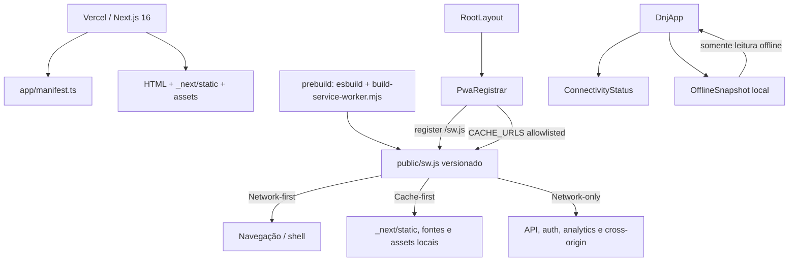

# Migração PWA — Design

**Spec**: `.specs/features/pwa-migration/spec.md`  
**Context**: `.specs/features/pwa-migration/context.md`  
**Status**: Approved

---

## Abordagens Consideradas

| Abordagem | Benefícios | Custos e riscos | Decisão |
| --------- | ---------- | --------------- | ------- |
| Next.js 16 + service worker próprio | Mantém App Router, Turbopack, Vercel e integrações atuais; controle explícito; menor mudança | Exige implementar versionamento, warmup, allowlist e atualização | **Selecionada e registrada em AD-001** |
| Next.js + Serwist | Precache e estratégias prontas | Nova dependência e integração adicional de build; complexidade acima do escopo atual | Reavaliar somente se a política manual crescer significativamente |
| Vite + `vite-plugin-pwa` | Plugin PWA maduro e build estático simples | Migração completa da stack, metadata e integrações; maior superfície de regressão | Rejeitada |

---

## Architecture Overview

A PWA será uma camada ao redor da aplicação existente. O App Router fornece manifest e metadata; um build script gera um `sw.js` versionado; um registrador client-side coordena registro, aquecimento do cache e atualização; o service worker aplica uma allowlist estrita; e um snapshot local mínimo permite reabrir a última área segura sem transformar respostas da API em cache offline.



### Fluxo da primeira carga

1. Next.js entrega a aplicação normalmente; nenhum service worker interfere na primeira resposta.
2. `PwaRegistrar` registra `/sw.js` após a hidratação.
3. O install do worker armazena o shell mínimo (`/`, manifest e ícones).
4. Quando o worker estiver pronto, o registrador coleta apenas URLs same-origin já carregadas via Resource Timing, filtra pela allowlist e envia `CACHE_URLS` ao worker.
5. O worker confirma `CACHE_READY`; somente então a sessão conta como preparada para reabertura offline.

Esse warmup explícito evita depender apenas do HTTP cache do navegador e atende ao requisito “após uma carga online bem-sucedida” sem introduzir um plugin de precache.

### Fluxo offline

1. Navegação para `/` usa network-first com timeout curto e fallback para o shell versionado.
2. Chunks imutáveis de `/_next/static/`, fontes self-hosted, ícones e imagens locais usam cache-first.
3. Requisições que não passam pela allowlist seguem diretamente para a rede e nunca são gravadas pelo worker.
4. Se houver `OfflineSnapshot`, a aplicação pode abrir a última tela principal segura em modo somente leitura e exibir quando o snapshot foi capturado.
5. Ações que dependem da API falham rapidamente com mensagem explícita e tornam-se tentáveis novamente no evento `online`.

### Fluxo de atualização

1. `scripts/build-service-worker.mjs` usa esbuild para empacotar o worker TypeScript e injeta uma revisão baseada no identificador de deploy/commit disponível ou em um hash determinístico dos inputs.
2. O navegador detecta conteúdo novo em `/sw.js`, servido com revalidação obrigatória.
3. O novo worker conclui install e permanece `waiting`; não chama `skipWaiting()` automaticamente.
4. O registrador apresenta uma notificação discreta “Nova versão disponível”.
5. Ao confirmar, o cliente envia `SKIP_WAITING`; após `controllerchange`, recarrega uma única vez.
6. No activate, o worker novo remove somente caches DNJ de revisões antigas que não pertencem à versão atual.

---

## Cache Policy

| Classe de requisição | Estratégia | Cacheável? | Observações |
| -------------------- | ---------- | ---------- | ----------- |
| `/sw.js` | Network-only + revalidação HTTP | Não no próprio SW | `Content-Type`, `Cache-Control: no-cache, no-store, must-revalidate` e CSP específica |
| Navegação same-origin para `/` | Network-first, fallback para shell | Sim | Armazenar apenas resposta `200` do tipo basic; timeout curto |
| `/_next/static/**` | Cache-first | Sim | Arquivos com hash; cache isolado por revisão |
| Ícones, imagens e fontes same-origin allowlisted | Cache-first | Sim | Somente extensões e destinos esperados; falha de um asset não derruba o shell |
| `/manifest.webmanifest` | Stale-while-revalidate ou cache-first versionado | Sim | Sem dados pessoais |
| Métodos diferentes de GET | Network-only | Não | Nunca enfileirar na primeira versão |
| Requisição com `Authorization` | Network-only | Não | Defesa adicional mesmo que a origem mude |
| API externa ou caminho same-origin `/v1/**` | Network-only | Não | Inclui login, verificação, ranking, filas e futuras APIs |
| Analytics, Speed Insights e qualquer cross-origin | Network-only | Não | Falha não bloqueia a aplicação |

### Invariantes de segurança

- A decisão de cache é positiva: apenas recursos explicitamente reconhecidos entram no cache.
- O service worker não lê nem grava `localStorage`, cookies ou tokens.
- Respostas `opaque`, parciais, de erro ou autenticadas não são armazenadas.
- Nomes de cache usam prefixo exclusivo `dnj-pwa-` e revisão; cleanup nunca remove caches de terceiros.
- Logs de desenvolvimento não incluem URL completa de API, headers, corpo, token, CPF ou e-mail.

---

## Code Reuse Analysis

### Existing Components to Leverage

| Component | Location | How to Use |
| --------- | -------- | ---------- |
| Metadata e viewport | `src/app/layout.tsx` | Expandir com PWA/apple metadata sem substituir Analytics, Speed Insights ou theme colors |
| Tokens claro/escuro | `src/app/theme.css` | Reutilizar nos estados de offline/atualização; nenhuma nova paleta |
| Poppins | `src/app/globals.css` | Substituir o `@import` remoto por `next/font/google`, preservando família e pesos |
| Shell e navegação | `src/components/dnj-app.tsx` | Inserir apenas conectividade, bootstrap do snapshot e ponto de render dos avisos |
| Cliente de API | `src/lib/api/client.ts` | Distinguir offline conhecido de timeout/API indisponível mantendo `ApiError` |
| Sessão local | `src/lib/storage.ts` | Reaproveitar padrão de leitura segura e limpeza no logout; não expor token ao snapshot PWA |
| Assets oficiais | `src/assets/brand/` | Fonte visual para gerar ícones quadrados e maskable sem alterar logos usados nas telas |
| Validação atual | `package.json` | Manter `typecheck`, `lint` e `build` como gates mínimos |

### Integration Points

| System | Integration Method |
| ------ | ------------------ |
| Next.js App Router | `manifest.ts`, metadata, `next/font` e componente client no layout |
| Next.js build | `predev`/`prebuild` geram `public/sw.js` a partir do template versionado |
| Vercel | Variáveis de sistema alimentam revisão; `next.config.ts.headers()` protege `/sw.js` |
| Browser Service Worker API | Registro, mensagens `CACHE_URLS`, `CACHE_READY`, `SKIP_WAITING` e `controllerchange` |
| Browser Network Information | Apenas `navigator.onLine` + eventos `online/offline`; não inferir qualidade real da conexão |
| API DNJ | Network-only; recuperação controlada pelo cliente, nunca pelo cache PWA |

---

## Components

### Web App Manifest

- **Purpose**: Descrever identidade, instalação e apresentação standalone.
- **Location**: `src/app/manifest.ts`.
- **Interfaces**: `manifest(): MetadataRoute.Manifest`.
- **Dependencies**: Ícones estáticos em `public/icons/`.
- **Reuses**: Nome, descrição, theme colors e idioma existentes em `layout.tsx` e `PRODUCT.md`.
- **Requirements**: PWA-01, PWA-04.

### PWA Icons

- **Purpose**: Fornecer assets instaláveis corretos para Android, iOS, navegador e fallback sem deformar ou cortar a marca.
- **Location**: `public/icons/`, `src/app/apple-icon.png` e `src/app/favicon.ico`.
- **Dependencies**: Assets oficiais em `src/assets/brand/`.
- **Reuses**: Identidade DNJ existente; nenhuma arte ou marca nova.
- **Requirements**: PWA-01, PWA-04.

#### Asset Matrix

| Plataforma/uso | Arquivo planejado | Formato e tamanho | Regras |
| -------------- | ----------------- | ----------------- | ------ |
| Android/Chromium — ícone padrão | `public/icons/icon-192x192.png` | PNG 192×192 | Fundo opaco da identidade; símbolo centralizado sem distorção |
| Android/Chromium — alta resolução | `public/icons/icon-512x512.png` | PNG 512×512 | Mesma composição do 192; usado no manifest como `purpose: "any"` |
| Android — adaptive/maskable | `public/icons/icon-maskable-512x512.png` | PNG 512×512 | Fundo preenchendo todo o canvas; conteúdo essencial dentro do círculo seguro central de raio 40% |
| iOS/iPadOS — Tela de Início | `src/app/apple-icon.png` | PNG 180×180 | Opaco, sem cantos arredondados embutidos; o sistema aplica sua máscara |
| Navegadores/atalhos | `src/app/icon.png` | PNG quadrado, 512×512 | Next.js gera o `<link rel="icon">`; derivado da mesma composição |
| Favicon legado | `src/app/favicon.ico` | ICO multiresolução, incluindo 16×16 e 32×32 | Símbolo simplificado e legível em tamanho pequeno |

O manifest referencia separadamente os ícones `any` e `maskable`; nunca marca o mesmo arquivo despreparado como maskable. `layout.tsx` mantém theme colors claro/escuro e adiciona `appleWebApp` com `capable`, título e `statusBarStyle`. A convenção `apple-icon.png` do App Router gera automaticamente o link correto para Safari/iOS.

### Service Worker Source

- **Purpose**: Implementar install, activate, fetch e protocolo de mensagens com allowlist segura.
- **Location**: `src/pwa/sw.ts` → empacotado e gerado em `public/sw.js`.
- **Interfaces**:
  - `install`: precache do shell mínimo.
  - `activate`: cleanup restrito e claim quando seguro.
  - `fetch`: matriz de estratégias por request.
  - `message`: `CACHE_URLS` e `SKIP_WAITING`.
- **Dependencies**: Revisão injetada no build e paths públicos.
- **Reuses**: `src/pwa/cache-policy.ts`; esbuild existe apenas no build e não vira dependência runtime.
- **Requirements**: PWA-02, PWA-03, PWA-05.

### Service Worker Build Script

- **Purpose**: Empacotar um worker cujo conteúdo muda junto do deploy e validar revisão, imports e saída.
- **Location**: `scripts/build-service-worker.mjs`.
- **Interfaces**: execução CLI sem argumentos; exit code não zero em template inválido.
- **Dependencies**: esbuild, `VERCEL_GIT_COMMIT_SHA`/identificador de deploy quando disponível e fallback determinístico local.
- **Reuses**: Scripts npm atuais via `predev` e `prebuild`.
- **Requirements**: PWA-05, PWA-06.

### PwaRegistrar

- **Purpose**: Registrar o worker, aquecer recursos carregados, expor prontidão e coordenar atualização segura.
- **Location**: `src/components/pwa/pwa-registrar.tsx`.
- **Interfaces**:
  - `registerPwa(): Promise<void>`.
  - mensagens tipadas `CACHE_URLS`, `CACHE_READY`, `SKIP_WAITING`.
  - estado `idle | registering | ready | update-available | unsupported | error`.
- **Dependencies**: Service Worker API e Resource Timing.
- **Reuses**: Root layout existente.
- **Requirements**: PWA-01, PWA-02, PWA-05, PWA-06.

### ConnectivityStatus

- **Purpose**: Expor conectividade conhecida e comunicar offline/retorno/atualização sem redesenhar telas.
- **Location**: `src/components/pwa/connectivity-status.tsx` e `src/hooks/use-network-status.ts`.
- **Interfaces**:
  - `useNetworkStatus(): { isOnline: boolean; changedAt: number }`.
  - propriedades para estado de atualização e callback de recarga segura.
- **Dependencies**: eventos `online/offline` e estado do registrador.
- **Reuses**: Tokens, radius, tipografia, reduced motion e padrões de feedback existentes.
- **Requirements**: PWA-03, PWA-04, PWA-05.

### OfflineSnapshot

- **Purpose**: Persistir somente o estado mínimo necessário para uma reabertura útil e somente leitura.
- **Location**: `src/lib/pwa/offline-snapshot.ts`.
- **Interfaces**:
  - `readOfflineSnapshot(): OfflineSnapshot | null`.
  - `writeOfflineSnapshot(snapshot: OfflineSnapshot): void`.
  - `clearOfflineSnapshot(): void`.
  - validação de versão e expiração lógica.
- **Dependencies**: `localStorage`, com guards SSR e tratamento de quota/corrupção.
- **Reuses**: padrão defensivo de `src/lib/storage.ts`.
- **Requirements**: PWA-02, PWA-03.

### API Offline Guard

- **Purpose**: Traduzir ausência conhecida de rede em erro específico e recuperável antes do timeout.
- **Location**: `src/lib/api/client.ts`.
- **Interfaces**: extensão compatível de `ApiError`, preservando chamadas existentes.
- **Dependencies**: `navigator.onLine` somente como sinal antecipado; erros reais de `fetch` continuam sendo autoridade.
- **Reuses**: mensagens e tratamento atuais de `ApiError`.
- **Requirements**: PWA-03.

---

## Data Models

### OfflineSnapshot

```typescript
interface OfflineSnapshot {
  schemaVersion: 1;
  capturedAt: string;
  lastMainScreen: "home" | "game" | "queue" | "account";
  user: {
    name: string;
    group: string;
    points: number;
    rankPosition: number;
  };
}
```

O snapshot não contém CPF, e-mail, cookie, token, headers, respostas brutas da API ou dados de formulário. É limpo no logout. Ao abrir offline, seu timestamp é apresentado como referência de atualização; ao voltar online, ações de rede continuam passando pela API.

### PwaClientMessage

```typescript
type PwaClientMessage =
  | { type: "CACHE_URLS"; urls: string[] }
  | { type: "SKIP_WAITING" };

type PwaWorkerMessage =
  | { type: "CACHE_READY"; revision: string }
  | { type: "CACHE_ERROR"; reason: string };
```

O worker revalida cada URL recebida; a mensagem do cliente nunca substitui a allowlist.

---

## Visual Preservation Contract

- Capturar baseline antes da primeira alteração de UI nos viewports móveis definidos na fase Tasks.
- Cobrir ao menos login, home, game, queue e account; home/account em temas claro e escuro.
- Desativar animações e estabilizar dados nos screenshots para eliminar ruído.
- Diferenças permitidas: apenas as regiões dos novos avisos offline/atualização e a renderização tecnicamente equivalente da mesma Poppins self-hosted.
- Fora dessas regiões, mudanças em geometria, cores, assets, textos, hierarquia e responsividade falham o gate visual.
- O componente de status usa tokens existentes e respeita safe areas, `max-w-md` e `prefers-reduced-motion`.

---

## Error Handling Strategy

| Error Scenario | Handling | User Impact |
| -------------- | -------- | ----------- |
| Service Worker API ausente | Marcar `unsupported`, não registrar | Aplicação online continua idêntica |
| Falha ao registrar worker | Log sanitizado em desenvolvimento; continuar sem PWA | Nenhum bloqueio do fluxo atual |
| Warmup parcial | Manter PWA não pronta; relatar falha sem apagar cache válido anterior | Offline pode ficar limitado, online segue normal |
| Navegação offline sem shell | Retornar resposta offline explícita se disponível; nunca resposta vazia | Usuário entende que precisa de primeira carga online |
| API offline | `ApiError` específico e ação repetível ao retornar conexão | Mensagem clara em português |
| Snapshot ausente/corrompido/expirado | Ignorar e abrir shell seguro; remover valor inválido | Sem crash ou dados fabricados |
| Quota de cache/localStorage | Preservar cache anterior, abortar nova gravação e registrar diagnóstico sanitizado | Aplicação online continua funcional |
| Worker novo aguardando | Exibir aviso discreto; ativar apenas por confirmação segura | Sem reload inesperado |
| `controllerchange` repetido | Guard de recarga única por sessão | Sem loop de reload |

---

## Risks & Concerns

| Concern | Location (file:line) | Impact | Mitigation |
| ------- | -------------------- | ------ | ---------- |
| Componente monolítico concentra todas as telas e estados | `src/components/dnj-app.tsx:1` e `:2281` | Pequenas mudanças podem causar regressões em várias telas | Limitar integração a snapshot/status e proteger com baseline visual; não refatorar telas nesta feature |
| Não existe restauração segura para uma experiência offline útil | `src/components/dnj-app.tsx:2281` | Reload offline volta ao login, onde ações exigem rede | Snapshot mínimo, versionado e somente leitura, separado da resposta de API |
| Token de identidade já é armazenado em localStorage | `src/lib/storage.ts:26` | Risco existente de exposição por JavaScript/XSS | Não copiar token para cache/snapshot; manter recomendação do README de migrar para sessão reconstruída por cookie `/users/me` em feature separada |
| Duas chaves de tema divergentes | `src/lib/storage.ts:6` e `src/components/dnj-app.tsx:2284` | Tema pode não restaurar de forma consistente | Escolher chave canônica e ler/migrar a chave legada sem alterar a preferência visual |
| Poppins depende do Google Fonts em runtime | `src/app/globals.css:1` | Offline pode trocar tipografia e quebrar fidelidade visual | Usar `next/font/google` no build e manter os mesmos pesos/variável CSS |
| Assets de marca não são quadrados/maskable | `src/assets/brand/` | Manifest pode ser inválido ou ícone cortado | Gerar derivados quadrados com safe zone; não alterar os logos usados nas telas |
| Service worker manual não conhece chunks do build automaticamente | `next.config.ts:1` | Primeiro reload offline pode faltar JS/CSS | Warmup pós-registro com Resource Timing + allowlist e confirmação `CACHE_READY` |
| Não há testes automatizados ou CI | `package.json:5` | Regressões PWA e visuais podem chegar à Vercel | Introduzir Playwright/validação de manifest e definir gates na fase Tasks |
| `navigator.onLine` não prova alcance da API | novo hook | Falso positivo em captive portal ou falha apenas do backend | Usar como sinal de UX antecipado, mas manter `fetch`/status/timeout como autoridade |
| Caches podem misturar deploys | novo service worker | Shell e chunks incompatíveis ou loop | Revisão injetada, caches por versão, worker waiting e teste de duas builds |

---

## Tech Decisions

| Decision | Choice | Rationale |
| -------- | ------ | --------- |
| Framework | Next.js 16 App Router | AD-001; menor risco e integração Vercel existente |
| PWA engine | Service worker próprio empacotado com esbuild | Escopo controlado, imports compartilhados e nenhuma dependência PWA em runtime |
| Cache boundary | Allowlist same-origin | AD-002; segurança e previsibilidade |
| API strategy | Network-only | Dados dinâmicos/autenticados nunca entram no cache PWA |
| First-load guarantee | Warmup + confirmação `CACHE_READY` | Não depender do HTTP cache implícito |
| Update activation | Worker waiting + confirmação | AD-003; não interromper sessão |
| Font | `next/font/google` para Poppins | Mesma identidade sem dependência externa em runtime |
| Offline state | Snapshot local mínimo e versionado | Reabertura útil sem cachear respostas ou credenciais |
| Visual regression | Baseline automatizada antes da implementação | “Manter o design” vira gate verificável |
| Assets instaláveis | Matriz Android/iOS com arquivos distintos | Cada plataforma recebe formato, tamanho e máscara corretos sem distorcer a marca |

---

## Requirement Coverage

| Requirement | Design Components | Coverage |
| ----------- | ----------------- | -------- |
| PWA-01 | Manifest, Icons, PwaRegistrar | Covered |
| PWA-02 | Service Worker, PwaRegistrar, OfflineSnapshot | Covered |
| PWA-03 | Cache Policy, ConnectivityStatus, API Offline Guard | Covered |
| PWA-04 | Manifest/Icons, self-hosted Poppins, Visual Preservation Contract | Covered |
| PWA-05 | Build Script, Service Worker lifecycle, PwaRegistrar | Covered |
| PWA-06 | Build Script diagnostics e futura suíte definida em Tasks | Covered |
