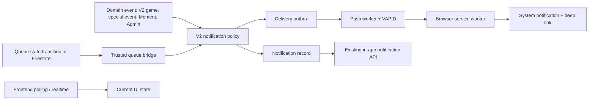

# Unified Notifications Design

**Spec:** `.specs/features/unified-notifications/spec.md`
**Status:** Draft — approved direction, ready for task breakdown

## Architecture Overview

The V2 API becomes the notification authority. It receives a domain event, evaluates policy and preferences, persists the participant's in-app record, and queues delivery outside the originating transaction. A worker sends Web Push to active device subscriptions. The frontend only obtains permission after an informed user action, manages browser subscriptions and presents push/in-app state.

Polling remains a separate state-reconciliation mechanism: participants continue polling Special Events, Game/Run state and Moment Challenges; managers continue polling operational game state. A poll response never means a push should be sent.



## Considered Approaches

| Approach | Trade-off | Decision |
| --- | --- | --- |
| Frontend decides from polling responses | Quick but duplicates policy across clients and cannot reach backgrounded apps. | Rejected |
| Send Web Push inline inside each domain transaction | Makes business writes depend on slow external delivery and complicates retry/rollback. | Rejected |
| V2 policy + persisted outbox + async dispatch | One authority, retries without duplicating business events, in-app fallback preserved. | Chosen |

The chosen design follows the browser model: an active service worker owns the subscription and handles incoming push with `showNotification`; subscriptions are device/service-worker specific and use the browser-provided endpoint and keys. [MDN Push API](https://developer.mozilla.org/en-US/docs/Web/API/Push_API) and [MDN PushManager](https://developer.mozilla.org/en-US/docs/Web/API/PushManager) support this flow. Notification tags can group/rewrite equivalent notices and click handlers should route from notification data. [web.dev notification behavior](https://web.dev/articles/push-notifications-notification-behaviour?hl=en)

## Code Reuse Analysis

| Existing component | Location | Design use |
| --- | --- | --- |
| Notification records, preferences and idempotency operations | `dnj-game-api/internal/app/services/notification_service.go` | Extend as the V2 policy/API boundary; do not duplicate in frontend. |
| Derived moderation writer | `dnj-game-api/internal/infrastructure/db/repositories/notification_event_writer.go` | Replace direct category writes with the unified event/outbox path. |
| Current special/Moment/Admin polling | `src/components/dnj-app.tsx` | Preserve for UI reconciliation; add event-ID deduplication only. |
| Queue realtime subscription | `src/features/queue/queue-screen.tsx` | Preserve participant position UI; emit an authenticated server-side queue-call event to V2. |
| PWA registrar | `src/components/pwa/pwa-registrar.tsx` | Expose the ready registration to the opt-in/subscription client. |
| Service worker push entrypoint | `src/pwa/sw.ts` | Add typed payload validation, tags, vibration and `notificationclick`. |
| History icon renderer | `src/components/ui/dnj-controls.tsx` | Map V2 icon tokens to existing Lucide icons. |

## Components and Interfaces

### V2 Notification Policy and Event Intake

- **Purpose:** Accept trusted domain events and convert only eligible events into participant notification records and delivery jobs.
- **Location:** `dnj-game-api/internal/app/services/notification_service.go` plus a focused event-intake interface.
- **Inputs:** category, source type/id, recipient, title/body template inputs, route, urgency/essential flag.
- **Rules:**
  - Eligible: queue call, Special Event, Moment Challenge, Admin announcement, Moment rejection/deletion/reversal.
  - Suppressed: normal points, check-in, participation, Moment submission and approval.
  - Queue call bypasses ordinary category preferences but never browser/OS permission.
  - Ordinary Admin messages never vibrate; urgent Admin messages may.
- **Reuses:** Existing category preferences, notification persistence and idempotency pattern.

### Subscription API

- **Purpose:** Bind one or more browser subscriptions to the authenticated V2 participant.
- **Location:** New protected V2 `/push/subscriptions` contract and repository/service methods.
- **Operations:** upsert subscription, list subscription state for account UI, deactivate subscription, remove endpoint after permanent push failure.
- **Security:** The frontend never supplies a user/external identity; V2 derives user ID from the session. Endpoint and encryption keys are treated as sensitive device capabilities and excluded from API list responses/logs.

### Delivery Outbox and Worker

- **Purpose:** Dispatch Web Push asynchronously and record outcome without blocking domain transactions.
- **Location:** V2 notification infrastructure/worker package.
- **Data contract:** A delivery references one persisted notification and one subscription, with a unique `(notification_id, subscription_id)` key, attempt count, status and last error class.
- **Behavior:** Retry transient failure with bounded backoff; deactivate the subscription on permanent invalid/expired endpoint response; do not duplicate a delivery after event retry.

### Queue Bridge

- **Purpose:** Convert the Firestore transition to `called` into a trusted V2 queue-call event.
- **Location:** `functions/` Firebase deployment package.
- **Boundary:** Firestore stays the queue's operational state source (AD-010). The bridge never dispatches browser push directly; it authenticates to V2, which applies policy and delivery.

### Frontend Opt-in and Subscription Client

- **Purpose:** Explain alert value, request permission from an explicit participant gesture, obtain the VAPID public key and upsert the `PushSubscription` with V2.
- **Location:** A new PWA notification client/hook used by post-onboarding prompt and account preferences.
- **States:** unsupported, not-asked, denied, granted-but-unsubscribed, subscribed, transient failure.
- **Reuses:** `PwaRegistrar` and current `notificationsApi` auth/idempotency client pattern.

### Service Worker Notification Runtime

- **Purpose:** Safely render payloads and route notification clicks.
- **Location:** `src/pwa/sw.ts` and its tests; build continues through `scripts/build-service-worker.mjs`.
- **Behavior:** Validate bounded title/body/route fields; set a stable notification tag from notification ID; include vibration only where policy sent it; close/focus/open an app client on click using `data.url`.

### In-app Reconciliation and History Icons

- **Purpose:** Preserve current banners/polling while preventing duplicate interruption and correcting visual icon mapping.
- **Location:** `src/components/dnj-app.tsx`, `src/components/live/live-status-stack.tsx`, `src/components/ui/dnj-controls.tsx`.
- **Behavior:** Compare notification/event IDs before showing a new banner; do not turn polling results into new notification events. Render tokens `trophy`, `medal`, `game`, `camera`, `shield` and `points`; unknown tokens use the generic points icon.

## Data Models

### PushSubscription

```go
type PushSubscription struct {
    ID        string
    UserID    uint64
    Endpoint  string
    P256DH    string
    Auth      string
    State     string // active | inactive
    CreatedAt time.Time
    UpdatedAt time.Time
    DisabledAt *time.Time
}
```

**Constraints:** unique endpoint; authenticated user owns the subscription; device subscriptions remain independent so one participant can have multiple devices.

### NotificationDelivery

```go
type NotificationDelivery struct {
    ID             string
    NotificationID string
    SubscriptionID string
    State          string // pending | sent | retrying | failed | inactive
    AttemptCount   int
    NextAttemptAt  *time.Time
    SentAt         *time.Time
    ErrorClass     *string
}
```

**Constraints:** unique `(notification_id, subscription_id)`; no payload secrets in error text or participant-facing API output.

### PushPayload

```ts
type PushPayload = {
  notificationId: string;
  title: string;
  body: string;
  url: "/queue" | "/game" | "/gallery?tab=mine" | "/notifications";
  tag: string;
  vibrate?: number[];
};
```

The backend constructs this payload from policy; the service worker validates it before display.

## Error Handling Strategy

| Scenario | Handling | Participant impact |
| --- | --- | --- |
| Permission denied/unsupported | Persist local opt-in outcome; leave in-app fallback active; require explicit later retry. | No broken loop or blocked app. |
| VAPID key/subscription failure | Show non-fatal setup status; do not claim device is subscribed. | Existing live updates continue. |
| Permanent push endpoint failure | Mark subscription inactive and stop retries. | In-app fallback; participant can re-enable later. |
| Temporary provider/network failure | Retry outbox with bounded backoff and metrics. | Possible delayed push, no duplicate. |
| Duplicate domain event | Idempotency key plus delivery uniqueness returns one record/delivery per participant. | One alert. |
| Queue bridge failure | Queue state remains correct in Firestore; bridge retry/monitoring occurs independently. | Realtime queue UI remains correct while push may be delayed. |

## Risks & Concerns

| Concern | Location | Impact | Mitigation |
| --- | --- | --- | --- |
| Existing frontend `/api/push/*` proxies an unconfirmed upstream contract; V2 has no subscription endpoint. | `src/app/api/push/subscribe/route.ts` | Current VAPID cannot be homologated end-to-end. | Replace with authenticated V2 contract before enabling opt-in; remove misleading Admin copy only after the V2 delivery path is verified. |
| Admin UI promises push but V2 only persists in-app broadcasts today. | `src/components/admin/admin-dashboard.tsx` | Operators can believe a device was alerted when it was not. | Return delivery status separately from recipient count and label the UI accurately. |
| Queue subscription exists only while QueueScreen mounts. | `src/features/queue/queue-screen.tsx` | A called participant outside the screen receives no current in-app queue notice. | Queue bridge creates V2 event; retain Firestore UI subscription as fallback. |
| Service worker handles `push` but has no click handler or payload validation. | `src/pwa/sw.ts` | Push cannot reliably navigate and malformed data has unclear behavior. | Typed payload validation and `notificationclick` tests. |
| Existing polling has three independent 15-second loops. | `src/components/dnj-app.tsx` | Extra requests and duplicate UI states. | Preserve initially; introduce shared event identity/dedupe before any future polling consolidation. |

## Tech Decisions

| Decision | Choice | Rationale |
| --- | --- | --- |
| Delivery | Transactional outbox plus asynchronous V2 worker | Keeps external push failure out of domain writes while supporting reliable retry. |
| Event authority | V2-only policy and dispatch | Enforces one source of truth across participant, Admin, manager and queue bridge. |
| Polling | Retained as state reconciliation | Managers and participant UI need current state even when no alert should be sent. |
| Queue integration | Firestore-to-V2 trusted bridge | Preserves AD-010 while keeping notification policy centralized. |
| Permission UX | Explicit post-onboarding opt-in | Browser permission is sensitive and requires participant intent. |
