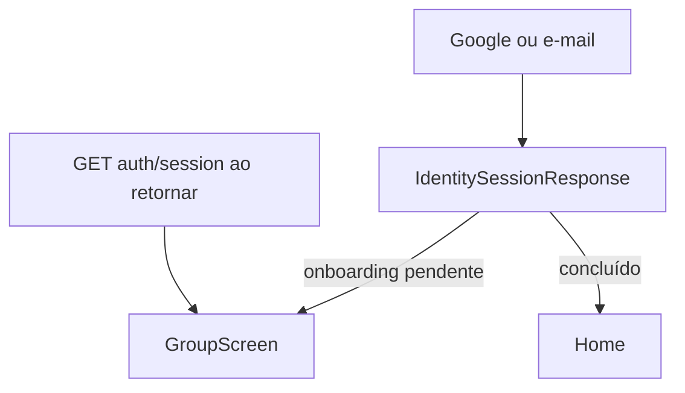

# Onda 1A — Design

**Spec:** `spec.md`
**Status:** aprovado pelo início da onda em 2026-08-28.

## Decisão

Reutilizar `LoginScreen`, `VerifyScreen`, `authApi` e a resposta `IdentitySessionResponse`; não criar rota nem cadastro paralelo. O callback de sucesso comum persiste sessão e direciona por `onboardingRequired || !onboardingComplete`.

## Reuso

| Item | Uso |
| --- | --- |
| `src/lib/api/auth.ts` | endpoints V2 existentes |
| `src/features/auth/auth-screens.tsx` | login e verificação existentes |
| `src/components/dnj-app.tsx` | persistência e roteamento de sessão |

## Riscos

| Risco | Mitigação |
| --- | --- |
| API não enumera e-mails | nenhum texto/UI tenta distinguir login de cadastro |
| botão GIS tem largura fixa | medir o container e renderizar novamente em resize |
| retorno do onboarding não tem código | voltar à entrada; bootstrap de sessão retorna ao onboarding |
