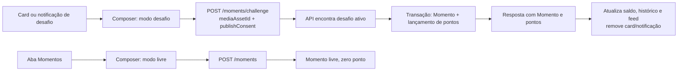

# Onda 3B — Design do Momento de Desafio

**Spec**: `.specs/features/wave-3b-challenge-moments/spec.md`
**Status**: Proposto

## Arquitetura escolhida

O desafio de foto ganha um contrato próprio. O endpoint normal de Momentos continua representando memória livre ou, enquanto houver legado, participação QR já existente. O endpoint novo não recebe identificador de participação nem de atividade: o backend resolve a atividade elegível, aplica as regras e faz a gravação/pontuação em uma transação.



## Contrato HTTP proposto

### `POST /v2/moments/challenge`

Autenticação de participante e `Idempotency-Key` obrigatória, seguindo o padrão já usado na publicação de Momentos.

```json
{
  "mediaAssetId": "uuid-do-upload",
  "publishConsent": true
}
```

Não aceita `participationId`, `challengeId`, `activityId`, cabeçalho de modo ou qualquer outro seletor de desafio. A resposta reutiliza o envelope de Momento atual, com `origin: "challenge"`, `activityId` preenchido, `participationId: null` e `pointsAwarded` com o valor concedido.

| Situação | Resposta |
| --- | --- |
| Desafio elegível e primeira foto | `201` com Momento e saldo/pontuação resultante. |
| Nenhum desafio elegível ou janela encerrada | `409 MOMENT_UNAVAILABLE`. |
| Mais de um desafio elegível | `409 MOMENT_UNAVAILABLE` e log de inconsistência operacional. |
| Participante já concluiu o desafio | `409 MOMENT_ALREADY_COMPLETED`. |
| Asset inválido, não pertence ao usuário ou sem consentimento | Erro de validação existente (`400`/`403`, conforme contrato de mídia). |
| Mesma `Idempotency-Key` | Reaproveita a resposta idempotente existente. |

### `POST /v2/moments`

Permanece como publicação de Momento livre para a aba Momentos: `mediaAssetId` e `publishConsent`, sem pontuação. Não recebe header `X-DNJ-Moment-Mode` e não busca desafio ativo implicitamente. A compatibilidade com o fluxo QR existente, se ainda necessária, fica explicitamente limitada ao uso documentado de `participationId`; não é usada por Desafio Momento.

## Backend e dados

| Camada | Responsabilidade |
| --- | --- |
| Router/handler | Registrar rota dedicada e desserializar somente os dois campos permitidos. |
| Service | Buscar atividade de desafio elegível, validar unicidade, criar Momento e ponto na mesma transação. |
| Repository | Consulta por atividade ativa e índice/consulta de conclusão por `user_id + activity_id`. |
| Migration | Permitir Momento de desafio sem participação QR e manter as FKs/checagens coerentes. |
| Notificação | Agendador/ativação emite aviso; publicação concluída suprime o aviso/card para o participante. |

### Mudança de schema obrigatória

O schema atual exige `participation_id` para `moments.origin = 'challenge'` e para lançamento de pontos de origem Momento. Isso é incompatível com o produto aprovado. A migration idempotente deve substituir essas checagens por regras equivalentes a:

```text
moments:
  free      -> participation_id IS NULL, activity_id IS NULL, points_awarded = 0
  challenge -> activity_id IS NOT NULL, participation_id pode ser NULL

point_entries:
  origin = moment -> moment_id IS NOT NULL, activity_id IS NOT NULL,
                     participation_id pode ser NULL
```

Também deve criar uma restrição única parcial para garantir uma única conclusão:

```sql
UNIQUE (user_id, activity_id) WHERE origin = 'challenge'
```

O service deve tratar a violação do índice como `MOMENT_ALREADY_COMPLETED`, para que concorrência nunca duplique os pontos.

## Frontend

| Ponto | Alteração proposta |
| --- | --- |
| `MomentComposer` | Prop `mode: 'free' | 'challenge'`; copy e CTA dependem do modo. |
| Card/notificação | Abrem `mode='challenge'`; não chamam `currentParticipation` e não exibem QR. |
| `media.ts` | Expõe duas operações explícitas: `publishFreeMoment` e `publishChallengeMoment`. Sem header de modo. |
| Aba Momentos | Abre exclusivamente `mode='free'`, sem saldo nem texto de pontuação. |
| Pós-sucesso | Atualiza overview/histórico/feed e invalida a consulta do desafio/notificação. |

## Reuso identificado

| Item atual | Local | Reuso |
| --- | --- | --- |
| Upload seguro de mídia | `src/lib/api/media.ts` | Mantém upload e progresso; apenas divide a publicação final. |
| Composer de foto | `src/features/moments/moment-composer.tsx` | Mantém captura, confirmação e preview; troca a decisão de rota pelo modo explícito. |
| Consulta de desafio ativo | `src/lib/api/moment-challenges.ts` | Mantém somente para exibir/ocultar card; não é fonte de verdade da publicação. |
| Idempotência/ponto/transação | Serviço/repositório de Momentos da API | Reusa padrão existente, com endpoint e constraints adequados. |

## Riscos e mitigação

| Risco | Impacto | Mitigação |
| --- | --- | --- |
| Header `X-DNJ-Moment-Mode` mistura contratos | Permite o frontend cair em caminho incorreto e não aparece na documentação | Remover o header e criar rota dedicada. |
| Constraint atual exige participação QR | Erro 500 ao publicar desafio | Migration antes de ativar a rota e teste de integração da transação. |
| Dois desafios simultaneamente ativos | Pontos no desafio errado | Tratar como conflito operacional; API não escolhe arbitrariamente. |
| Retry/concorrência | Pontuação duplicada | Chave de idempotência + índice único parcial + transação. |
| Card fica visível após conclusão | UX inconsistente | A resposta de sucesso invalida o estado local e a consulta retorna somente desafios não concluídos para o usuário. |

## Decisões técnicas locais

| Decisão | Escolha | Razão |
| --- | --- | --- |
| Identidade da atividade | Resolução exclusiva no servidor | Evita fraude e elimina dependência de QR/participation. |
| Seleção do modo | Endpoint, não header | Contratos verificáveis e sem estado implícito. |
| Participação QR | Não é criada nem reutilizada | É outro domínio e outro fluxo de produto. |
