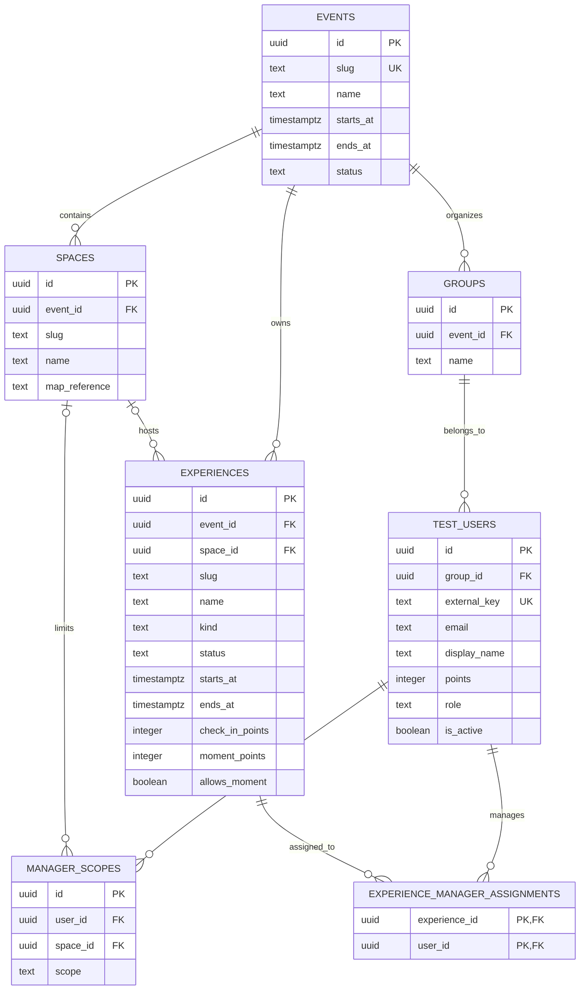
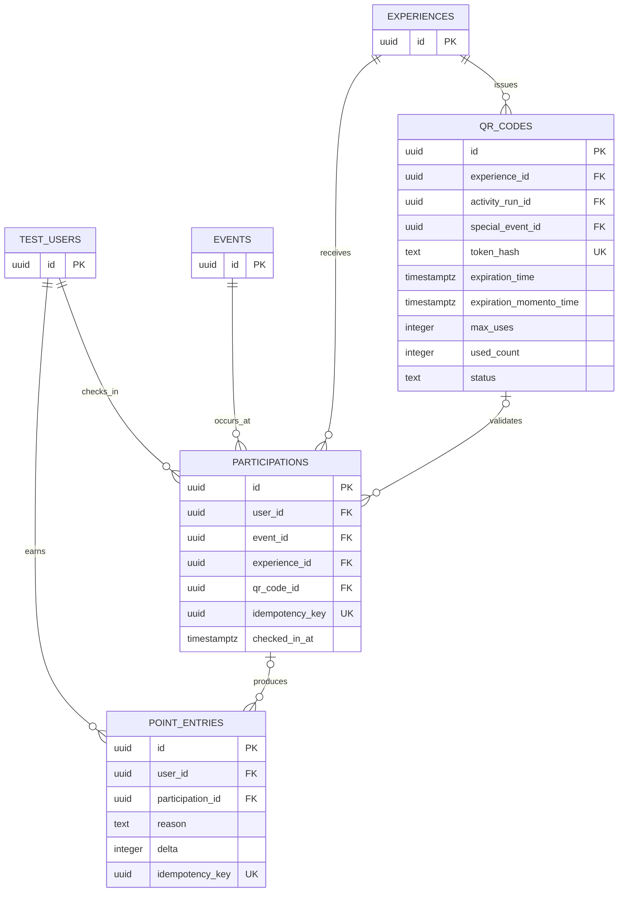
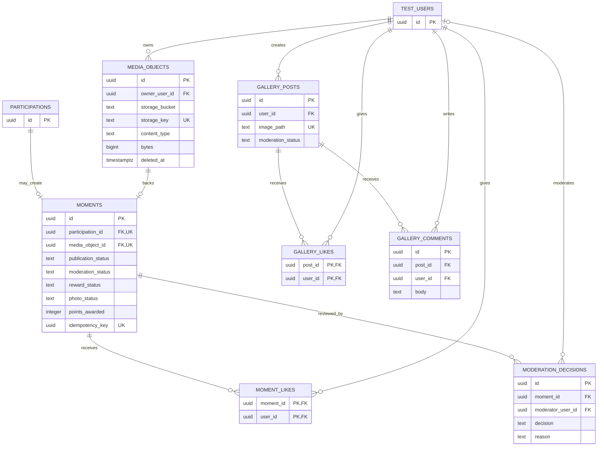
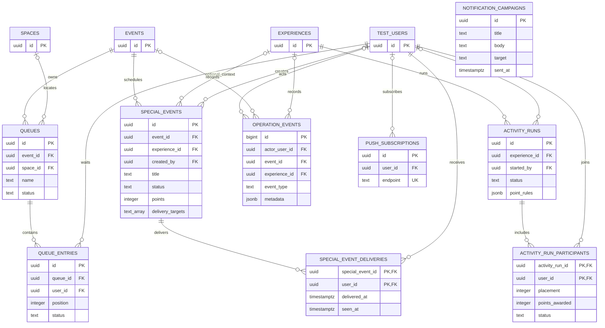

# DNJ — Banco de dados (estado atual no Supabase)

Fonte de verdade consultada em 2026-08-06: projeto Supabase `kawuwdvrisvbkucsnbep` (26 tabelas em `public`, todas com RLS habilitado). Cole cada bloco Mermaid no Eraser para editar visualmente. Os quatro blocos foram separados para o canvas não ficar ilegível.

## 1. Núcleo do evento e identidade

## 2. QR, participação e pontuação

## 3. Momentos, mídia e moderação

## 4. Operação ao vivo, filas e notificações

## Rotinas de banco relevantes

- `validate_dnj_qr`: valida QR e cria/recupera participação de modo idempotente.
- `moderate_moment` e `dnj_award_moment`: moderam e pontuam momentos.
- `dnj_finalize_activity_run_v2`: consolida as colocações de uma atividade.
- `dnj_admin_login`, `dnj_operator_login` e `dnj_admin_upsert_manager`: sessões e gestão operacional.
- Triggers: `dnj_set_updated_at`, guarda/fechamento de QR de activity run.

## Pontos de desenho para discutir

1. `test_users` é ao mesmo tempo participante, administrador e gestor (coluna `role`) e ainda recebe escopos em `manager_scopes`; é uma escolha funcional, mas tende a concentrar responsabilidades de identidade.
2. Há duas galerias: legada (`gallery_*`) e atual (`moments`, `media_objects`, `moment_likes`). A API já marca as rotas `gallery` como depreciadas; decidir a data de remoção evita duplicidade permanente.
3. `experiences` é a entidade central e também recebe `kind` para vários conceitos. É um bom ponto para avaliar se `special_events` e `activity_runs` devem continuar como extensões, como estão hoje, ou virar subtipos mais explícitos.
4. `operation_events.metadata` e `activity_runs.point_rules` são JSONB: ótimos para auditoria/regra variável, mas campos usados para filtro ou relatório recorrente devem virar colunas/indexes.
