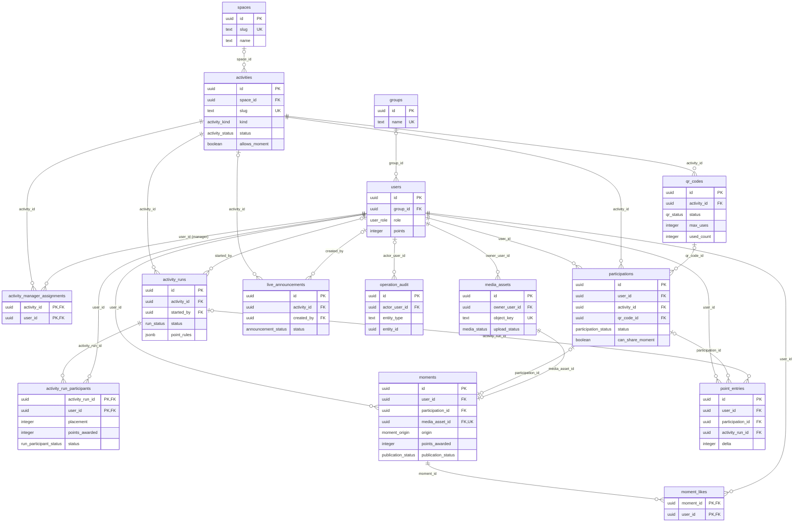

# DNJ V2 — Exemplos E2E de população

| Documento relacionado | Uso |
| --- | --- |
| [DNJ V2 — Backend Handoff](DNJ-V2-BACKEND-HANDOFF.md) | Schema, regras transacionais e contrato HTTP V2. |
| Convenção | UUIDs estão abreviados; campos obrigatórios não relevantes foram omitidos. |
| Fora do modelo V2 | Não existem tabelas `events`, `gallery` ou `queues`. |

## Mapa de blocos e referências

| Bloco | Tabelas | Referências diretas |
| --- | --- | --- |
| Identidade | `groups`, `users` | `users.group_id → groups.id` |
| Local e atividade | `spaces`, `activities`, `activity_manager_assignments` | `activities.space_id → spaces.id`; `activity_manager_assignments.activity_id → activities.id`; `activity_manager_assignments.user_id → users.id` |
| Check-in | `qr_codes`, `participations` | `qr_codes.activity_id → activities.id`; `participations.user_id → users.id`; `participations.activity_id → activities.id`; `participations.qr_code_id → qr_codes.id` |
| Competição | `activity_runs`, `activity_run_participants` | `activity_runs.activity_id → activities.id`; `activity_runs.started_by → users.id`; `activity_run_participants.activity_run_id → activity_runs.id`; `activity_run_participants.user_id → users.id` |
| Mídia e feed | `media_assets`, `moments`, `moment_likes` | `media_assets.owner_user_id → users.id`; `moments.user_id → users.id`; `moments.participation_id → participations.id`; `moments.media_asset_id → media_assets.id`; `moment_likes.moment_id → moments.id`; `moment_likes.user_id → users.id` |
| Pontuação | `point_entries`, `users` | `point_entries.user_id → users.id`; `point_entries.participation_id → participations.id`; `point_entries.activity_run_id → activity_runs.id`; `point_entries.delta → users.points` |
| Comunicação e auditoria | `live_announcements`, `operation_audit` | `live_announcements.activity_id → activities.id`; `live_announcements.created_by → users.id`; `operation_audit.actor_user_id → users.id` |

## Cenário 1 — Radicalidade, QR e Moment livre sem ponto

### Referências por bloco

| Ordem | Bloco | Entrada | Saída / referência |
| --- | --- | --- | --- |
| 1 | Identidade e local | `groups`, `users`, `spaces` | `usr-ana`, `usr-bia`, `usr-joao`, `sp-radical` |
| 2 | Configuração | `activities`, `activity_manager_assignments`, `activity_runs`, `qr_codes` | `act-radical`, `run-01`, `qr-rad-1` |
| 3 | Check-in e rodada | `participations`, `qr_codes`, `activity_run_participants` | QR usado duas vezes; Ana e Bia entram na rodada |
| 4 | Resultado | `activity_runs`, `activity_run_participants`, `point_entries`, `users` | `run-01` fechado; Ana +50, Bia +10 |
| 5 | Moment livre | `media_assets`, `moments`, `moment_likes` | Foto pública sem `participation_id` e sem ponto |
| 6 | Auditoria | `operation_audit` | Fechamento da rodada por João |

### 1. Identidade e local

| groups.id | name |
| --- | --- |
| `grp-luz` | Jovens da Luz |

| users.id | display_name | group_id | role | points inicial | email |
| --- | --- | --- | --- | ---: | --- |
| `usr-ana` | Ana Souza | `grp-luz` | `participant` | 0 | ana@… |
| `usr-bia` | Bia Lima | `grp-luz` | `participant` | 0 | bia@… |
| `usr-joao` | João Gestor | `null` | `manager` | 0 | joao@… |

| spaces.id | name | map_reference |
| --- | --- | --- |
| `sp-radical` | Espaço Radicalidade | `map:radicalidade` |

### 2. Configuração da Radicalidade

| activities.id | space_id | kind | name | status | check_in_points |
| --- | --- | --- | --- | --- | ---: |
| `act-radical` | `sp-radical` | `competitive` | Radicalidade | `active` | 0 |

| activity_id | user_id |
| --- | --- |
| `act-radical` | `usr-joao` |

| activity_runs.id | activity_id | started_by | status inicial | point_rules |
| --- | --- | --- | --- | --- |
| `run-01` | `act-radical` | `usr-joao` | `active` | `{"first":50,"participation":10}` |

| qr_codes.id | activity_id | token_hash | status | max_uses | used_count inicial |
| --- | --- | --- | --- | ---: | ---: |
| `qr-rad-1` | `act-radical` | `sha256(token-01)` | `active` | 50 | 0 |

### 3. Check-in por QR

| Endpoint | Idempotência | Efeito |
| --- | --- | --- |
| `POST /v2/qr/validate` | Uma chave por leitura | Cria/reutiliza Participation e incrementa `qr_codes.used_count`. |

| participations.id | user_id | activity_id | qr_code_id | status | check_in_points |
| --- | --- | --- | --- | --- | ---: |
| `part-ana-r1` | `usr-ana` | `act-radical` | `qr-rad-1` | `active` | 0 |
| `part-bia-r1` | `usr-bia` | `act-radical` | `qr-rad-1` | `active` | 0 |

| qr_codes.id | used_count após leituras |
| --- | ---: |
| `qr-rad-1` | 2 |

| activity_run_id | user_id | placement | points_awarded | status |
| --- | --- | ---: | ---: | --- |
| `run-01` | `usr-ana` | `null` | 0 | `participating` |
| `run-01` | `usr-bia` | `null` | 0 | `participating` |

### 4. Resultado da rodada

| Endpoint | Operação atômica | Resultado |
| --- | --- | --- |
| `POST /v2/manager/runs/run-01/results` | Fecha run, registra colocações, cria lançamentos e atualiza saldo. | Ana em 1º; Bia participante. |

| activity_runs.id | status final |
| --- | --- |
| `run-01` | `completed` |

| activity_run_id | user_id | placement | points_awarded | status |
| --- | --- | ---: | ---: | --- |
| `run-01` | `usr-ana` | 1 | 50 | `awarded` |
| `run-01` | `usr-bia` | `null` | 10 | `awarded` |

| point_entries.id | user_id | activity_run_id | reason | delta |
| --- | --- | --- | --- | ---: |
| `pe-run-a-01` | `usr-ana` | `run-01` | `radicality_run` | 50 |
| `pe-run-b-01` | `usr-bia` | `run-01` | `radicality_run` | 10 |

| users.id | display_name | points após resultado |
| --- | --- | ---: |
| `usr-ana` | Ana Souza | 50 |
| `usr-bia` | Bia Lima | 10 |

### 5. Moment livre

| Fluxo | Referência |
| --- | --- |
| Upload | `POST /v2/media/upload-intents` → S3 → `POST /v2/media/{mediaAssetId}/complete` |
| Criação | `POST /v2/moments` sem `participationId` |
| Pontuação | Sem `point_entries`; saldo permanece Ana=50 e Bia=10. |

| media_assets.id | owner_user_id | object_key | upload_status | bytes |
| --- | --- | --- | --- | ---: |
| `media-ana-free` | `usr-ana` | `private/usr-ana/0a1b2c.jpg` | `available` | 1.400.000 |

| moments.id | user_id | participation_id | origin | points_awarded | publication_status | media_asset_id |
| --- | --- | --- | --- | ---: | --- | --- |
| `moment-ana-free` | `usr-ana` | `null` | `free` | 0 | `public` | `media-ana-free` |

| moment_id | user_id |
| --- | --- |
| `moment-ana-free` | `usr-bia` |

### 6. Auditoria

| operation_audit.id | actor_user_id | action | entity_id |
| --- | --- | --- | --- |
| `audit-run-01` | `usr-joao` | `activity_run.close` | `run-01` |

## Cenário 2 — Anúncio especial e Moment de desafio pontuado

### Referências por bloco

| Ordem | Bloco | Entrada | Saída / referência |
| --- | --- | --- | --- |
| 1 | Configuração | `spaces`, `activities`, `live_announcements` | `act-foto-galera` anunciado no app e TV |
| 2 | Entrada no desafio | `participations` | `part-ana-foto-01` habilita uma foto |
| 3 | Mídia e prêmio | `media_assets`, `moments`, `point_entries`, `users` | Moment de desafio; Ana +30 pontos |
| 4 | Guardrails | `media_assets`, `participations`, `activities`, `moments` | Ownership, janela, elegibilidade e unicidade validados |

### 1. Configuração do desafio e anúncio

| spaces.id | name |
| --- | --- |
| `sp-palco` | Palco Principal |

| activities.id | space_id | kind | name | status | allows_moment | moment_points |
| --- | --- | --- | --- | --- | --- | ---: |
| `act-foto-galera` | `sp-palco` | `challenge` | Foto com a galera | `active` | `true` | 30 |

| live_announcements.id | activity_id | title | status | points | delivery_targets |
| --- | --- | --- | --- | ---: | --- |
| `live-foto-01` | `act-foto-galera` | Foto com a galera! | `active` | 30 | `app`, `tv` |

### 2. Entrada no desafio

| Endpoint | Referência | Alternativa |
| --- | --- | --- |
| `POST /v2/moment-challenges/act-foto-galera/participations` | Cria/reutiliza a Participation de desafio. | Se houver QR, `POST /v2/qr/validate` cria a mesma entidade. |

| participations.id | user_id | activity_id | qr_code_id | status | can_share_moment |
| --- | --- | --- | --- | --- | --- |
| `part-ana-foto-01` | `usr-ana` | `act-foto-galera` | `null` | `active` | `true` |

### 3. Upload, Moment de desafio e prêmio

| media_assets.id | owner_user_id | object_key | upload_status |
| --- | --- | --- | --- |
| `media-ana-challenge` | `usr-ana` | `private/usr-ana/3d4e5f.jpg` | `available` |

| moments.id | user_id | participation_id | origin | points_awarded | reward_status | media_asset_id |
| --- | --- | --- | --- | ---: | --- | --- |
| `moment-ana-foto-01` | `usr-ana` | `part-ana-foto-01` | `challenge` | 30 | `awarded` | `media-ana-challenge` |

| point_entries.id | user_id | participation_id | reason | delta |
| --- | --- | --- | --- | ---: |
| `pe-moment-ana-01` | `usr-ana` | `part-ana-foto-01` | `moment_award` | 30 |

| users.id | display_name | points após desafio |
| --- | --- | ---: |
| `usr-ana` | Ana Souza | 80 (`50 + 30`) |
| `usr-bia` | Bia Lima | 10 |

### 4. Regras de validação

| Regra | Referências verificadas |
| --- | --- |
| Propriedade da mídia | `media_assets.owner_user_id = moments.user_id` |
| Upload concluído | `media_assets.upload_status = available` |
| Participação própria | `participations.user_id = moments.user_id` |
| Participação da Activity correta | `participations.activity_id = act-foto-galera` |
| Activity elegível | `activities.allows_moment = true` |
| Janela válida | Activity/QR ainda permitem o Moment. |
| Uma foto por desafio | Índice parcial: um `moments.participation_id` não nulo por Participation. |
| Repetição idempotente | Mesmo `Idempotency-Key` retorna `moment-ana-foto-01`, sem novo Moment ou PointEntry. |

## Cobertura de tabelas pelos cenários

| Tabela V2 | Cenário 1 | Cenário 2 |
| --- | --- | --- |
| `groups` | Grupo Jovens da Luz | Reutilizado |
| `users` | Ana, Bia e gestor | Ana e admin reutilizados |
| `spaces` | Espaço Radicalidade | Palco Principal |
| `activities` | Radicalidade competitiva | Desafio de foto |
| `activity_manager_assignments` | João gerencia Radicalidade | Pode atribuir gestor do desafio |
| `qr_codes` | QR dinâmico lido | Opcional no desafio |
| `participations` | Leitura de QR | Entrada no desafio |
| `activity_runs` | Rodada da Radicalidade | Não necessário |
| `activity_run_participants` | Ana e Bia classificadas | Não necessário |
| `media_assets` | Foto livre de Ana | Foto de desafio |
| `moments` | `free`, zero ponto | `challenge`, 30 pontos |
| `moment_likes` | Bia curte foto livre | Igual se Moment for público |
| `point_entries` | Pontos da Radicalidade | Prêmio do Moment |
| `live_announcements` | Não necessário | Anúncio especial ativo |
| `operation_audit` | Fechamento do run | Auditoria de abertura/fechamento possível |

## Diagrama entidade-relacionamento — schema V2 completo

